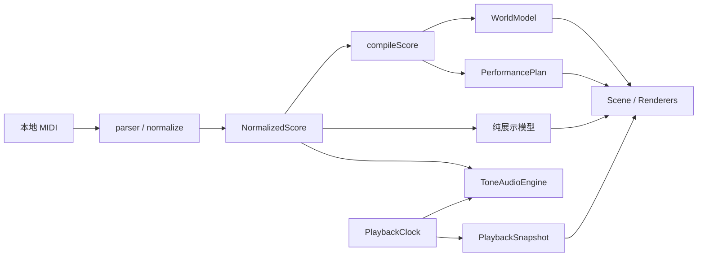

# Codebase Audit · Harmonic Motion

Purpose: 记录全仓审计的可核对证据、严重程度和分步修复路线。
Authority: 保留 2026-10-05 的审计快照，逐项追加修复状态；不替代产品 ROADMAP。
Update when: 复现结果、问题状态、优先级或验收证据改变。
Last verified: 2026-10-06；原审计源码基线 `e15cad575396607d01f2225529fbe6b9a75527ab`，第1步修复证据见下文。

## 结论与范围

音乐核心的分层成立：解析、音乐分析、几何、编舞、播放时钟、音频和展示各有入口；没有必要重写核心引擎。优先处理的是**保存数据的信任边界、按时长分配内存、展示生命周期和失败恢复**，然后才是拆分 App 和性能优化。

原审计只修改文档，共记录 **13 项：P0 0 项、P1 2 项、P2 8 项、P3 3 项**。2026-10-06 已修复 A01/A02；其余 **11 项仍为 Open**。未发现 P0 不等于完成了安全认证。文档漂移的修正另记于 [KNOWN_LIMITATIONS](docs/KNOWN_LIMITATIONS.md#d03-audit-documentation)。

读取范围为基线的 119 个跟踪文件：58 个 `src` 文件（56 个 TS/TSX、2 个 CSS）、16 个测试/fixture 文件、31 个 docs 文件，以及根配置、启动脚本等 14 个文件。逐文件读取第一方源码、测试、配置、现存开发文档和历史计划；锁文件按依赖结构核查，二进制 MIDI fixture 做解析检查，图片作为已有文档资源核对，不做二进制内容的代码审计。

不将 `node_modules`、`dist`、忽略的 `artifacts`、用户未跟踪的 `midi/` 和产品计划 DOCX 算作第一方待重构代码；没有改动这些用户资料。未进行第三方依赖漏洞扫描、浏览器视觉复验、GPU/声卡测量或用户真实曲库故障注入。

## 架构、依赖与阅读入口

完整架构图、模块依赖表及状态所有权见 [开发者入口](docs/developer/index.md)。当前链路为：

注意音频读取 score，而非视觉筛选后的音符或碰撞事件。`compileScore` 内部顺序是 analyze → strategy.generate → planPerformance。视图、风格、效果切换不编译音乐。

对 56 个 TS/TSX 文件做静态 import 图核查：176 条本地 import 声明，其中 95 条为纯类型声明；忽略 type-only 边后，**没有发现第一方运行时 import 环**。这是 import 图检查，不代表事件流或状态之间没有逻辑耦合；也未递归分析第三方包。

| 层 | 入口、关键类/函数 | 详细文档 |
| --- | --- | --- |
| 应用入口、UI、状态 | `main.tsx`、`App`、`createStudioStore`、`loadSavedState` | [应用与状态](docs/developer/application-state.md) |
| 数据、输入、分析 | `NormalizedScore`、`parseMidi`、`normalizeScore`、`analyzeScore`、`groupOnsets` | [音乐流水线](docs/developer/music-pipeline.md) |
| 几何、编舞 | `compileScore`、`GeometryStrategy`、`ConstellationGeometryStrategy`、`planPerformance`、`evaluatePerformer` | [音乐流水线](docs/developer/music-pipeline.md) |
| 播放、声音 | `PlaybackClock`、`PlaybackController`、`NoteScheduler`、`ToneAudioEngine` | [播放与音频](docs/developer/playback-audio.md) |
| 展示、绘制、镜头 | `createMusicalPresentation`、`createEnsemblePresentation`、`buildInkFrame`、`Scene`、`CameraRig` | [视觉与渲染](docs/developer/visual-rendering.md) |
| 工具、示例、启动 | `upperBound`、`seededRandom`、`createQuickStudyScore`、Windows launcher | [配置与启动](docs/developer/setup-and-configuration.md) |

## 严重程度与证据标准

- **P0**：普通路径下的大面积不可用、不可逆数据破坏或严重安全事件，立即阻断交付。
- **P1**：特定输入/保存状态可导致页面不可用、显著资源耗尽或保存数据丢失；应优先修复。
- **P2**：局部功能错误、恢复缺口、展示不连续或验证工具给出误导结果。
- **P3**：可维护性、冗余、需测量的性能问题；应在行为保障之后处理。

“复现”指本轮执行了对应纯函数/受控 mock；“静态确认”指代码路径明确，但未在真实浏览器触发；“风险”指影响依赖环境或负载。下面各项单独标注，不能将 mock 结果当作真实浏览器或音频故障记录。

| ID | 级别 | 发现 | 证据 |
| --- | --- | --- | --- |
| A01 | P1 · Resolved 2026-10-06 | 保存乐谱校验过浅；部分恢复后覆盖原始记录 | 正式回归 + 隔离浏览器原数据核对，见下方修复记录 |
| A02 | P1 · Resolved 2026-10-06 | Ensemble 按曲目秒数分配数组，所有 View 都会准备它 | 稀疏 Map 回归 + 极长曲浏览器验证，见下方修复记录 |
| A03 | P2 | 水墨重复音永久复用旧 anchor，落点滑出画面 | 纯函数复现 |
| A04 | P2 | 动态轨迹更新坐标后包围球不更新 | Three CPU 复现；页面视觉待复验 |
| A05 | P2 | Ensemble 淡出阶段复用进度字段，路径突然收缩 | 纯函数复现 |
| A06 | P2 | IndexedDB abort / blocked 缺少结束与恢复路径 | abort-only mock + 静态检查 |
| A07 | P2 | 多窗口整库覆盖；偏好与曲库保存缺少一致性边界 | 静态风险，未操作真实曲库 |
| A08 | P2 | 音频调度失败后时钟仍播放；初始化错误反馈不完整 | 控制器 mock 复现 + UI 静态检查 |
| A09 | P2 | 保存偏好可覆盖 reduced-motion 初始关闭效果 | 静态确认 |
| A10 | P2 | benchmark 入口未适配当前独立 Ink，且使用正式存储 | 静态确认，未测 GPU |
| A11 | P3 | App 汇集过多职责，暂停仍定时更新整个组件树 | 静态确认，耗时未量化 |
| A12 | P3 | 全模式预计算、窗口前缀扫描及单包体积 | 静态复杂度 + 构建实测 |
| A13 | P3 | 重复哈希、旧导出/配置字段、局部弱类型契约 | 全仓引用核对；不自动判定应删除 |

## 问题详单

### A01 · P1 · 保存数据校验与失败记录保留

**状态：Resolved · 2026-10-06。** 读取保留 unknown 原值；[sessionValidation.ts](src/state/sessionValidation.ts) 在编译前核对元数据、有限数值、排序、ID 和 note/track/chord 一致性。`restoreSessions` 返回 `{restored,rejected}`；任一拒绝会暂停本次会话的曲库和偏好写入，持续提示并提供刷新/导入入口。成功曲目仍可用，新导入仅在内存；原数据库保留。活动曲未恢复时不应用其旧 position。正式用例在 [session.test.ts](tests/session.test.ts)、[persistence.test.ts](tests/persistence.test.ts)，真实浏览器证据见 [第1步验证](docs/VERIFICATION.md#audit-step-1-2026-10-06)。以下保留原始发现，不是当前实现描述。

**位置**：[persistence.ts](src/state/persistence.ts) `loadSavedState`（51–59 行）；[store.ts](src/state/store.ts) `restoreSessions`（58–73 行）；[App.tsx](src/ui/App.tsx)（103–163 行）。

读取 IndexedDB 时把结果标注为 `SavedSession`，只验证 id、filename、seed、notes/tracks 数组。并未校验 metadata、chords、duration、音符字段、排序和引用关系。TypeScript 类型不会验证磁盘里的对象。

本轮给 `restoreSessions` 一个 `{duration:1, notes:[], tracks:[], chords:[]}` 乐谱：返回恢复数 1，激活该曲，`metadata` 仍为 undefined。它满足存储层的浅过滤条件；随后 UI 读取 `score.metadata.title` 会失败。另一个 tracks 为 `[{}]` 的记录被编译 catch 丢弃；App 仍启用 `storageReady`，接着保存成功恢复的 sessions，**覆盖原键中的失败记录**。后者未向用户真实数据库写入，本轮确认的是完整静态写入路径。

**最小修复**：把读取结果视为 unknown；验证/迁移完整 score 契约后再编译。返回明确的恢复结果（成功、隔离、原因），部分恢复时保留原记录，禁止自动用残缺库覆盖它。给出重试/重新导入入口，不以“清空数据库”作为默认恢复方法。先复用 normalization 的规则，再决定是否需要独立 validator；不引入与现有格式无关的通用 schema 框架。

**验收**：缺 metadata、非法时长、乱序/缺字段音符、重复 ID、坏轨道、未知版本、部分恢复；坏数据不进入 Scene，成功记录可用，原失败记录仍可恢复，自动保存不悄悄删除。

### A02 · P1 · 稀疏长曲导致无界时长数组

**状态：Resolved · 2026-10-06。** energy 改为仅含起音秒桶的 `Map<number,number>`，保留峰值归一化和相邻秒插值；Scene 按需准备 Ensemble/Ink 模型。normalize 拒绝 time+duration 溢出为 Infinity；没有新增任意最大曲长限制。[ensemble-presentation.test.ts](tests/ensemble-presentation.test.ts) 实际运行 37 字节、134217728 秒的 MIDI，energy.size=1，正常运动数值对照通过；该曲也在隔离浏览器进入所有视图。见 [第1步验证](docs/VERIFICATION.md#audit-step-1-2026-10-06)。以下保留原始发现。

**位置**：[ensemblePresentation.ts](src/visual/presentation/ensemblePresentation.ts) `createEnsemblePresentation` 第 46 行；[Scene.tsx](src/render/Scene.tsx) 第 39–41 行；[normalize.ts](src/midi/normalize.ts) 第 35 行。

`energy = Array.from({length: Math.ceil(score.duration)+2}, ...)`，之后还执行 `map` 生成另一份数组。成本由时长决定，而非音符数量；Scene 在所有 View 中无条件创建 ensemble 模型。文件大小和 20,000 音符限制没有约束这条分配路径。

**证据**：仅 1 音符、86401 秒的模型实际分配 86403 个 energy 元素。另构造 37 字节的 Type 0 / PPQ=1 MIDI，首音 delta=`0x0fffffff`、持续 1 tick；通过安装的 MIDI 库解析和实际 `normalizeMidi` 后时长为 **134217728 秒**，预计 energy 长度 **134217730**。未对这个极端样本运行 Scene 或分配大数组，避免影响机器；它满足当前 parser 的头部/类型/大小/音符数量条件。另有有限 time + 有限 duration 溢出为 Infinity 的内部输入边界尚无校验。

**最小修复**：energy 改为仅记录有事件的秒桶，并在查询时用缺省 0 插值；Scene 按实际模式准备必要模型。输入边界同时验证最终 duration 有限，按明确产品规则处理异常长曲；不能只提高数组上限。稀疏存储应先于扩大支持时长。

**验收**：单个很晚的音符、长静默、长持续音、空谱及正常密集谱；模型内存随事件数量受控，各 View 均可进入；对正常曲目逐时刻比较运动数值不变。

### A03 · P2 · 宣纸落墨重复音消失

**位置**：[inkPresentation.ts](src/visual/presentation/inkPresentation.ts) 第 42–48、99、125–128 行。

相同音高、同 lead 状态、相邻间隔 ≤0.9 秒时始终继承最初 anchor；`repeats` 虽限制为 3，却不限制 anchor 的年龄。画卷持续向前滚动，新的短音仍画在最初位置，最终被视口裁掉。

**复现**：单轨 60 个 MIDI 60 音符，每 0.5 秒起音、持续 0.25 秒、velocity 0.8；`buildInkFrame(model,'drops',t,1050,620)` 在 5/10/12/20 秒分别输出 **11/21/0/0** 个 mark，最新音符 anchor 始终为 0。不是显示预算耗尽。

**最小修复**：给重复音聚合设定时间/次数边界，超过后建立新落点；使用音符序列和绝对时间确定分段，禁止按播放帧“搬动” anchor。

**验收**：连续同音 30 秒、带休止的同音、主/辅声部与随机 seek；新起音保持可见，局部重复晕染仍存在，正放与直达同一时刻一致。

### A04 · P2 · 动态轨迹视锥裁剪使用旧包围球

**位置**：[TrajectoryRenderer.tsx](src/render/TrajectoryRenderer.tsx) 第 18–34 行。

每帧写入 position buffer 并设置 needsUpdate，但未重算 `boundingSphere`，也未关闭 `lineSegments` 的默认 frustum culling。Three 已缓存的包围球不会因属性 needsUpdate 自动更新。

**复现**：线段先在 x=0/1 求包围球，再移动 buffer 到 x=100/101，镜头看向 x=100；`Frustum.intersectsObject` 使用旧球返回 false，重算球后返回 true。确认了底层裁剪错误条件，尚未在产品浏览器重现实际消失画面。

**最小修复**：对这一小条动态轨迹关闭裁剪，或在几何改变时维护正确包围体，二选一。不要因此全局禁用所有场景裁剪。

**验收**：先播放近处片段，再 seek 到远处并移动镜头；轨迹端点和可见性正确，空段 drawRange 保持 0。

### A05 · P2 · Ensemble 淡出边界路径跳变

**位置**：[ensemblePresentation.ts](src/visual/presentation/ensemblePresentation.ts) 第 156–168 行；[EnsembleRenderer.tsx](src/render/EnsembleRenderer.tsx) 第 70 行。

active 阶段 `progress=1`；fading 阶段把 progress 重用为“消散进度”，从 0 重新增长。`ensemblePath` 却始终用它作为空间展开进度，所以音符主体留在外层时，中间路径点突然退回内部。

**复现**：同 A03 乐谱第 11 个音符，在结束前后各 1 微秒求 8 点路径，倒数第二个点跳变 **2.7847 个世界单位**；端点仅变化约 0.03055。既有测试仅覆盖接近时路径端点，未覆盖这个边界。

**最小修复**：空间展开进度在发声后保持 1，淡出进度独立用于透明度/余韵；无需重做内向外舞台。

**验收**：生命周期所有阶段交界、长短音、静音/暂停/逆向 seek；消散时路径连续，不要求原本设计的所有共鸣参数都数值连续。

### A06 · P2 · IndexedDB 异常无法结束等待

**位置**：[persistence.ts](src/state/persistence.ts) 第 31–76 行。

读写事务仅监听 complete/error，未监听 abort；打开连接未处理 blocked，成功连接未处理 versionchange。显式 abort-only 等情形可能让 Promise 永久 pending；App 依赖读取 finally 开启后续初始化，因此可能一直显示 restoring。当前 schema 固定 v1，blocked 主要是未来升级/另一连接竞争的风险。

**复现**：受控 IDB mock 仅触发 abort 事件，`saveSessions([])` 在 20ms 观察窗口后仍 pending，原因是未注册事件处理；不是对浏览器事务失败发生率的测量。

**最小修复**：abort 明确 reject；blocked 给出可操作状态，versionchange 关闭过期连接并使缓存可重建；初始化失败允许进入临时会话。按实际需要决定超时，不添加盲目重试循环。

**验收**：complete/error/abort/blocked/versionchange、存储不可用与重试；所有操作进入终态，不挂住页面，不重复保存、不清空库。

### A07 · P2 · 保存操作缺少多窗口一致性

**状态：Open。** 2026-10-06 的 A01 修复已限定 position 只用于匹配的已恢复曲目；本项的多窗口整库覆盖与跨键事务一致性仍未解决。

**位置**：[App.tsx](src/ui/App.tsx) 第 158–173 行；[persistence.ts](src/state/persistence.ts) `save`。

sessions 是一个整体键，preferences 是另一个独立事务键。两个同 origin/profile 窗口可持有旧库，各自保存后发生后写覆盖；第二个窗口新增/删除也不会通知第一个。中途关闭可能造成 activeSessionId/position 与 sessions 不匹配，恢复时回退 demo 后仍尝试应用旧位置。当前没有 revision、冲突检测或跨窗口协调。

这是静态风险；本轮未通过两个真实浏览器窗口覆盖用户库。每 3 秒保存和 pagehide 也是尽力而为，不能承诺最后一帧可靠落盘。

**最小修复**：先定义一个明确策略：单写者/冲突提示，或按 session ID 做事务合并。将一次曲目选择相关数据的一致性纳入事务，恢复时只向匹配曲目应用 position。不要直接引入云同步。

**验收**：两个隔离测试页面交错增删/保存/关闭；不丢别处新增记录；活动曲目和位置匹配；老格式可读。

### A08 · P2 · 音频失败与页面恢复状态不完整

**位置**：[controller.ts](src/playback/controller.ts) 第 14–19 行；[App.tsx](src/ui/App.tsx) 第 141–156 行及 `if (!ready)`；[Scene.tsx](src/render/Scene.tsx) `SceneBoundary`。

控制器先 `clock.play()`，再执行可能抛错的 `audio.seek()`。受控适配器在 seek 抛出 `schedule failed` 后，play Promise 拒绝，但 clock.status 仍为 **playing**；画面可继续走而声音没有开始。Tone 的后续定时 pump 同样没有错误向 UI 传播的通道。

另有静态恢复缺口：初次 `controller.load` 拒绝只 setError，ready 保持 false，而启动占位页不展示该错误或重试。SceneBoundary 位于三个模型 useMemo 之后，也包不到 App，所以不能兜住模型准备和曲库数据的异常。当前 Tone.load 对正常乐谱没有网络请求，此项不声称正常启动必失败。

**最小修复**：定义 play/load/seek 失败后的状态（至少暂停时钟并清理声音）；页面初始化展示失败与恢复操作；边界涵盖可能失败的准备阶段。保持一个时钟，不用第二套计时掩盖错误。

**验收**：unlock 失败、seek/首次 pump 失败、load 拒绝、播放中 pump 失败及过期异步完成；无静默推进、残留声音、永久启动占位或重复启动。

### A09 · P2 · reduced motion 与保存效果偏好竞争

**位置**：[App.tsx](src/ui/App.tsx) 第 109–120、198–204 行；[EnsembleRenderer.tsx](src/render/EnsembleRenderer.tsx) 的 media listener。

App 挂载时根据 reduced motion 关闭效果，但异步读回 `effectsEnabled=true` 又将三类效果开启；App 不监听之后的系统偏好变化，Ensemble 局部运动却有自己的监听。不同模式对同一系统偏好的响应不一致。

**最小修复**：先明确“系统减少动态”和“用户显式开启效果”的优先级，区分保存偏好与实际生效值；集中计算有效效果，避免多个 effect 互相覆盖。系统偏好改变时同步更新。

**验收**：系统 reduce + 历史 effects On、无历史偏好、用户手动改变、运行中切换系统设置及 View 往返。当前只有静态顺序证据，需浏览器验收。

### A10 · P2 · benchmark 入口与当前 Ink 脱节

**位置**：[benchmark.tsx](tests/browser/benchmark.tsx) 第 6、27–35 行；[Scene.tsx](src/render/Scene.tsx) `frameloop`；[RenderDiagnostics.tsx](src/render/RenderDiagnostics.tsx)。

独立 benchmark 只 import `styles.css`，缺少正常入口的 `ink.css`；Capture metrics 取第一个 canvas，而当前 Ink 是第二个独立 WebGL2 canvas，第一幅 R3F 在 Ink 下隐藏且停止帧循环。因此其 renderMetrics 不能代表 Ink，甚至可能是切换前残留数据。synthetic 曲目通过正式 App/store 加入，同 origin 下还会触发正式曲库保存。

**最小修复**：入口加载与正式 App 一致的样式；指标显式注明 renderer、模式、采样区间，新 Ink 需要自己的诊断；benchmark 使用独立 origin/profile 或隔离存储，避免污染用户曲库。

**验收**：三个 View、两种 Ink 模式各采样；指标来源正确、无旧值沿用；退出诊断后正式库完全不变。历史 2026-09-28 旧 Ink 指标不能当作 10-01 新 renderer 的基准。

### A11 · P3 · App 职责与更新范围过大

**位置**：[App.tsx](src/ui/App.tsx) 共 483 行，尤其第 30–186 行和后半 JSX。

同一组件负责引擎实例、存储恢复/保存、媒体偏好、导入取消、快捷键、曲库、全屏、相机设置和两套界面。`useStudio()` 订阅整个 store；rAF 每隔 >32ms 创建新的 React 播放状态，暂停时也运行，曲库列表和静态控件随之重新执行。问题是职责和更新范围，而非单纯超过某个行数阈值。

**建议拆分顺序**：先补应用生命周期集成测试；再提取播放桥接、持久化恢复两个有明确输入/输出的 hook；最后拆曲库面板与 transport。保留高频时间在 snapshot ref，暂停时只在状态实际变化时更新 UI。不要一次引入通用事件总线或把所有 UI 状态塞进 Zustand。

**验收**：相同输入下 load/dispose/save 次数不增加；StrictMode 无重复副作用；播放/暂停/seek/切歌/换肤引用契约通过；React Profiler 比较暂停和播放渲染次数，再报告收益。

### A12 · P3 · 有限显示预算不等于有限准备/查询成本

**位置**：[Scene.tsx](src/render/Scene.tsx) 第 39–41 行；[musicalPresentation.ts](src/visual/presentation/musicalPresentation.ts) `notesInWindow`；[inkPresentation.ts](src/visual/presentation/inkPresentation.ts) 第 102–113 行；[ensemblePresentation.ts](src/visual/presentation/ensemblePresentation.ts) `visibleEnsembleNotes`；[scheduler.ts](src/audio/scheduler.ts) `reset`。

- Scene 无条件建立 musical、ensemble、ink 三个模型。切主线会重新准备；大量保存曲目也在主线程同步重新编译。
- `notesInWindow` 和 Ink block 查询虽然二分终点，仍从第 0 块开始扫描，基础成本约 O(此前音符数 / 32)，再过滤/排序候选。Ensemble 同声部去重使用 `occupied.some`，候选对比最坏为二次复杂度；本轮未测其实际耗时占比。
- `NoteScheduler.reset` 二分后仍 slice/filter 全部此前音符来恢复长音，seek 成本为 O(N)。这是合理简单实现，未有测量前不必先换复杂 interval tree。
- 当前生产 JS 单块 1,456.25 kB，gzip 398.53 kB；构建给出 >500kB advisory。局域本机使用的影响与公网首屏不同，不能仅凭包大小判为严重性能故障。

**建议**：先修 A02；建立按准备/逐帧/seek/React/GPU 分层的基准，覆盖 100/700/2000/5000/20000 音符、长静默、长持续音和多会话；根据热点选择懒准备、块级下界索引、输出 buffer 复用或代码分块。不要在本轮凭估计加入 Worker/ECS。

**验收**：同机器/视口/曲目/时段比较 median/P95 和内存，记录预热/后台节流；输出数量、排序、端点、seek 确定性和不重载音频保持不变。

### A13 · P3 · 重复实现、无生产消费者字段与类型债务

**重复**：Ink `seedOf` 与 Ensemble `stableUnit` 都是同一 FNV 风格字符串哈希；App 三处重复修改 hit/trail/particles enabled。下一次实际修改这些行为时可提取小函数，并保持哈希结果/属性引用语义，当前无需搭建通用 utility 层。各 renderer 的 instance 更新看似相似，但坐标、透明、资源生命周期不同，不宜强行统一。

**全仓引用结果**：

| 符号 | 当前证据 | 后续处理 |
| --- | --- | --- |
| `selectReadableNodeIds` | 只有定义及 `visual.test.ts` 调用；WorldRenderer 用 `selectDisplayNodes` | 核实旧测试价值后删除或迁移，不让测试专用旧实现制造覆盖错觉 |
| `MusicalPresentation.chordIds / maxDuration` | 只声明与构建，没有下游读取 | 对照历史兼容承诺，再去掉无收益分配 |
| `VisualTheme.connectionStyle`、`palette.connection` | 只在类型/默认配置定义，当前 renderer 不读 | 确认要支持还是移除，防止新主题作者调参无效 |
| `ENSEMBLE_STAGE.bounds` | Scene 使用 `ensemble.bounds`，未读此静态 bounds | 核查扩展边界后删除旧值 |
| `branding.candidates` | 只有定义，无产品消费 | 作为历史候选移入文档或明确保留理由 |

这些是第一方静态引用结果，不是对公共 npm API 的兼容性判断；项目是 private 应用。`createDemoScore`、fixture、RenderDiagnostics 有测试/开发消费者，不算死代码。

**类型**：严格 TS/lint 已通过，无本轮发现的编译错误或 `as any`/ts-ignore。运行时边界仍存在 A01；`InkMark.type` 是普通 number，而 shader 约定 0/1/2，12-float/48-byte 排布横跨 CPU packing 和 shader。后续可将 mark kind 收紧为联合类型并记录/校验布局，避免盲目 `!` 掩盖初始化失败。接口可写不等于真的发生输入突变；现有不变性测试仍有价值。

**验收**：先查所有引用，再做窄删除/提取；构建、测试、视觉样本哈希或数值对照；不顺手清理无关源文件。

## 检查项覆盖与验证记录

| 用户要求 | 本轮结论 |
| --- | --- |
| 重复代码 | A13；没有证据支持大规模统一 renderer |
| 潜在 bug | A01–A05、A08–A10；确认/风险分开标注 |
| 异常处理缺失 | A01、A06、A08；不新增与当前输入无关的防御框架 |
| 类型问题 | A01 运行时边界、A13 shader 协议；strict TS 无错误 |
| 性能瓶颈 | A02 已确认的分配模型；A11/A12 为待 profiling 热点 |
| 不合理耦合 | App orchestration、Scene 全模型准备、benchmark 共用正式存储；未发现运行时 import 环 |
| 超长文件 | App 483 行最值得分职责；179 行 Ensemble / 171 行 Ink 模型按阶段可读性改善即可，不按长度机械拆分 |
| 未使用代码 | A13 列出具体生产无消费者项；未删除任何源码 |
| TODO/FIXME | 在 src/tests/scripts/README/AGENTS/docs 中按单词边界搜索，审计前无 TODO/FIXME/HACK/XXX，也无 ts-ignore/ts-expect-error/as any/eslint-disable；无标记不代表无债务 |

2026-10-05，Windows、Node 24.18.0、npm 11.16.0：

- `npm run test`：12 文件 / **90 测试通过**。
- `npm run lint`：通过。
- `npm run build`：strict TypeScript 与 Vite 构建通过；大块体积 warning 如 A12。
- 诊断使用临时 Node/Vite 模块装载、Three CPU 运算及 IDB/audio mock，没有加入正式测试集，没有操作真实 IndexedDB。复现步骤和输出见各项，**未来修复时必须将关键用例转为回归测试**。
- 已有 fixture：`tempo-and-voices.mid` 329 字节，经安装库和 normalize 得到 24 音符、2 轨道、8.1875 秒；`invalid.mid` 20 字节被拒绝。现有 parser 回归包含在 90 测试内。
- 诊断装载 parser 时遇到 Vite SSR 对 CommonJS 命名导出的互操作错误，改用安装库的 Node require + 实际 normalize 检查 fixture；本应用不是 SSR 产品，未将诊断工具装载限制计为产品缺陷。

现有测试主要覆盖纯模型、控制器、store 和 mock 音频；不覆盖真实 IndexedDB 事务、App 全生命周期、GL 裁剪/资源、系统 reduced-motion 竞争和浏览器失败恢复。因此全绿与上述发现不矛盾。

## 逐步修复与重构路线

第1步已在用户授权下实施并验证，修复提交 `f9e2900` 已上传 GitHub，见 [归档计划](docs/plans/completed/2026-10-06-audit-input-recovery.md) 与 [验证记录](docs/VERIFICATION.md#audit-step-1-2026-10-06)。后续仍为建议顺序；执行前依照 [DEVELOPMENT_WORKFLOW](docs/DEVELOPMENT_WORKFLOW.md) 建立有限 plan，每步可单独验收和回退，不打包成全仓重写。

| 步骤 | 范围与产出 | 进入下一步的验收门槛 |
| --- | --- | --- |
| 1 · 保存与输入边界 · 已验证 | A01/A02：unknown 解码、失败记录保留、有限时长、稀疏 energy | 118 测试、lint/build 与隔离浏览器通过；原记录保留，energy 内存不按时长分配 |
| 2 · 展示正确性 | A03/A04/A05：重复音聚合边界、动态包围体、独立生命周期进度 | 新回归 + 同曲同时间浏览器对照；长同音、远距 seek、淡出连续；world/plan 引用和音频 load 次数保持 |
| 3 · 失败与一致性 | A06/A07/A08/A09：事务终态、窗口写入策略、播放失败回退、有效效果偏好 | 使用隔离数据库的应用集成测试；错误可见可恢复；真实浏览器 reduced-motion/两窗口检查；无数据丢失 |
| 4 · 可信诊断 | A10：区分 renderer 指标、完整 CSS、独立测试存储 | 三种 View 和 Ink 指标可信、正式库无变化；形成后续性能对照基线 |
| 5 · 小步拆分 | A11/A13：按行为边界拆 App，清理已确认冗余，补配置协议 | 每次移动前后测试通过；load/save/dispose 不增；diff 无音乐算法变化 |
| 6 · 按测量优化 | A12：只处理已证实的准备、查询、帧或加载热点 | 相同基准有可复核收益；不降低主线/和弦语义、不破坏 seek；未改善的优化不合并 |

每步共同约束：test/lint/build；视觉相关补浏览器；保存相关补真实/模拟事务；音频相关补异步竞争和声部清理；启动器若改变需测试固定 CMD 和关窗清理。禁止用移除音符、重编译视图、重置进度或重新 load 音频来“修复”展示问题。

## 文档交付与维护

新增 [开发者文档目录](docs/developer/index.md)，覆盖模块、类/函数、数据/状态流、配置、启动、FAQ、常见错误、规范和扩展方式；README 保持面向使用者，只增开发入口。已有 `/docs` 作为唯一知识目录沿用，不再创建另一套互相竞争的架构说明。

修复某项后保留本次证据，添加修复提交、回归用例和验证日期，再改状态；不要把此快照中的风险悄悄当作已解决。审计与产品路线图分别维护，通过链接连接，不据此自动展开新功能。
