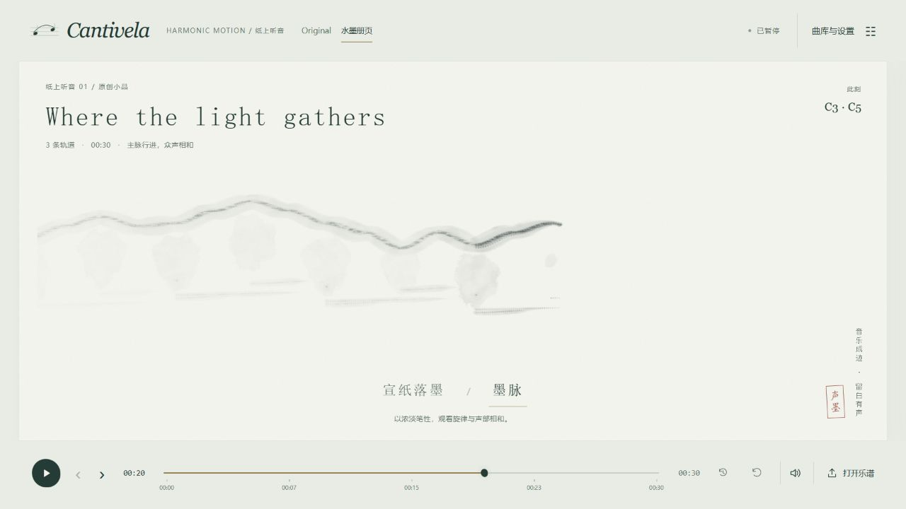

# Cantivela · Project Harmonic Motion

**把一首音乐，放进可以观看的空间。**

Cantivela 是在自己电脑上运行的 MIDI 音乐可视化应用。打开一首曲子，它会根据音符、起音、时值、轨道与和弦生成画面，并用内置合成器演奏。你可以在星座、流动舞台、圆形舞台和水墨册页之间切换，随时暂停、跳转或换曲。

*画面来自项目内置的原创短曲《Where the light gathers》，停在 00:20。*

## 开始使用

需要 Node.js 和 npm；Windows 一键启动还需要已安装的 Microsoft Edge 或 Google Chrome。项目在 Node.js 24 上完成开发验证。

1. 下载本仓库，或在终端获取源码：

   ~~~sh
   git clone https://github.com/Ranmor107/harmonic-motion.git
   cd harmonic-motion
   ~~~

2. 首次使用，在项目目录安装依赖：

   ~~~sh
   npm ci
   ~~~

3. Windows 用户双击 [start-harmonic-motion.cmd](start-harmonic-motion.cmd)。它会打开独立的应用窗口；关闭该窗口时，会停止它启动的本地服务。曲库保存在这个专用浏览器资料中，下次仍可恢复。

也可以在项目目录运行：

~~~sh
npm run dev
~~~

然后打开终端给出的本地地址。普通浏览器标签页关闭后，开发服务仍会运行；在终端按 Ctrl+C 停止。普通浏览器与一键启动窗口使用不同的浏览器资料，曲库不会互相出现。

首次进入会显示约 31 秒的原创示例曲。点击 **Listen to a study** 试听，或点击 **Open my MIDI** 导入自己的乐谱。浏览器通常需要先点击播放，才能开启声音。

## 选择观看方式

在 **Controls / 曲库与设置 → View / 观看空间** 中选择舞台；页头可在 **Original** 与 **水墨册页** 之间切换。水墨册页会进入 Stream，并在纸面下方提供两种表达。

| 舞台 | 会看到什么 |
| --- | --- |
| **Constellation** | 音符与声部形成空间关系，适合观察连接和整体结构；可选 Overview、Focus 或 Current path |
| **Stream · Original** | 正面展开的 Ribbon 主线及伴随音群，适合跟随音乐在时间中前进 |
| **Ensemble** | 圆形舞台中按声部组织的音符，从内层向外浮现 |
| **Stream · 水墨册页** | **宣纸落墨**强调起音、晕染和余韵；**墨脉**用不同笔势呈现主线、伴奏与和声 |

切换观看方式会保留当前歌曲时间。水墨画面自动随时间展开；它没有 3D 相机的拖拽和缩放。切到其他舞台时会显示原版画面，回到 Stream 时会记住此前选择的水墨风格。

在设置中，**Part focus / 主线** 可选自动主线或指定一条 MIDI 轨道。被指定的轨道会更突出，其他轨道仍会发声。MIDI 轨道不一定对应真正的旋律或独立声部；自动主线也只是画面选择规则。

## 播放、曲库和画面控制

| 操作 | 用法 |
| --- | --- |
| 播放 / 暂停 | 底部主按钮；暂停会停止声音并固定画面 |
| 时间轴 | 拖动到任意位置；画面根据该时间重新呈现，播放中的长音也会恢复 |
| 重听最近 10 秒 / Restart | 前者回退 10 秒并播放，后者从头播放 |
| 上一曲 / 下一曲 | 在底部切换曲目；新曲从头开始 |
| 打开乐谱 / Add MIDI | 选择一份或多份 .mid、.midi 文件，加入当前浏览器的本机曲库 |
| Controls / 曲库与设置 | 打开右侧面板，选择舞台、主线、视觉效果、音量和曲目；面板中的 × 可移除本机保存的曲目副本 |
| 静音 / 音量 | 底部切换静音，面板中调节音量；静音不暂停时间 |
| 全屏 | 面板中的 Fullscreen / 全屏观看；再次点击或按 Esc 退出 |

在舞台或页面空白处还可以使用键盘：

| 按键 | 功能 |
| --- | --- |
| 空格 | 播放 / 暂停 |
| ← / → | 后退 / 前进 5 秒 |
| R | 重听最近 10 秒 |
| F | 切换全屏 |
| Esc | 退出全屏，或关闭设置面板 |

原版 3D 舞台支持滚轮缩放、拖拽平移与 Fit / Reset。Constellation 和原版 Stream 可选择跟随视角；跟随时仍可调整放大倍率。水墨册页使用固定纸面取景。关闭视觉效果后，核心音符与主笔势仍然可见。

## 导入与本机保存

支持带音乐节拍时间（PPQ）的 Standard MIDI Type 0 / 1 文件；单文件不超过 10 MiB、20,000 个音符。Type 2、SMPTE 计时和空乐谱会被拒绝。批量导入时，成功的文件仍会加入曲库，失败文件会显示原因。

导入的乐谱、最近曲目、时间位置、轨道焦点、观看方式、水墨模式、音量等保存在**当前浏览器的本机存储**中。重新打开时恢复到上次位置，但保持暂停。文件在本机解析，不上传到服务器；本项目没有账号或云同步。

请保留原始 MIDI 文件：清除站点数据、使用隐私窗口、更换浏览器或更换一键启动所用的浏览器资料，都可能让保存的曲库不可用。移除曲目只删除浏览器内的副本，不删除电脑上的原文件。

如果出现“本机记录无法恢复”，正常恢复的曲目仍可播放，原保存数据会保留。此时本次曲库与设置改动只在内存中，关闭后不会保存；可在曲库面板刷新重试或重新导入原 MIDI。不要直接清除站点数据。

## 使用边界与常见问题

- **没有声音？** 先点击播放以启用浏览器音频，再检查底部静音、面板音量及系统输出设备。
- **水墨或 3D 画面空白？** 检查浏览器图形加速；水墨画面需要 WebGL2。可先切换到其他观看方式确认控件和歌曲仍可使用。
- **MIDI 无法导入？** 检查文件扩展名、上述格式和大小限制；必要时从制谱软件重新导出为 Type 0 / 1 PPQ。
- **曲库怎么不见了？** 确认使用的是上次的浏览器资料和同一本地站点地址；一键启动窗口与普通浏览器的曲库分开保存。

音频由项目根据 MIDI 音符合成，不会还原原曲的真实乐器、踏板或弯音。密集乐谱会有展示抽样，画面不一定显示每一个音符。项目目前不提供视频导出；如需保存演奏画面，可使用电脑上的录屏工具。[完整的已知边界](docs/KNOWN_LIMITATIONS.md)另有说明。

## 开发与文档

开发检查和生产构建：

~~~sh
npm run test
npm run lint
npm run build
npm run preview
~~~

继续开发请从 [开发者文档](docs/developer/index.md) 开始：包含架构图、模块与关键函数、音乐/状态流、配置、启动、FAQ 和扩展指南。正式音乐流程为 MIDI → NormalizedScore → WorldModel → PerformancePlan；声音直接从乐谱按同一时钟调度，画面消费音乐计划或展示投影。

[全仓审计与分步重构路线](CODEBASE_AUDIT.md) 记录问题及逐项状态；第1步已修复保存数据恢复和稀疏长曲内存问题，见 [修复验证](docs/VERIFICATION.md#audit-step-1-2026-10-06)。[知识索引](docs/index.md)、[当前能力](docs/CURRENT_STATE.md)、[架构契约](docs/ARCHITECTURE.md)、[开发流程](AGENTS.md)和[水墨集成验证](docs/VERIFICATION.md#ink-folio-2026-10-01)分别保存长期事实与历史证据。

<!--
Purpose: 项目面向使用者的介绍、安装与操作入口。
Authority: 启动与用户操作指南；架构和长期限制见链接的仓库文档。
Update when: 启动方式、用户操作或公开支持边界变化。
Last verified: 2026-10-06；补损坏记录恢复说明与修复验证入口；启动方式未改变。
-->
