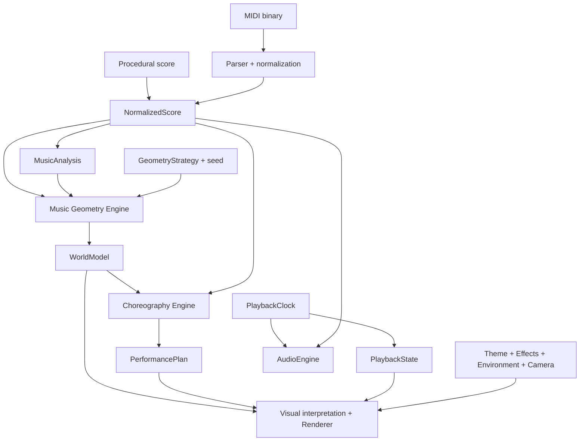

# Music Geometry Engine · Architecture

Purpose: 定义稳定架构、音乐时间语义和不可破坏原则。
Authority: 架构事实与契约的主要记录；当前支持状态不在此维护。
Update when: 已落实的核心契约、语义、ownership 或 invariant 改变。
Last verified: 2026-09-18；展示投影和会话缓存边界已更新；未改音乐核心契约。

任务定位从 [文档导航](index.md) 与 [模块地图](CODEBASE_OPERATING_MODEL.md) 开始。核心管线继续保留；Stream 的展示投影边界见 [ADR-0001](decisions/ADR-0001-musical-presentation.md)。

## Product philosophy

**The score compiles a world.** 音乐规定节点、关系与抵达时刻。几何、编舞、播放、音频、视觉分别解释各自的数据，不通过碰撞或逐帧积分来决定音乐。



音频直接消费 `NormalizedScore` 的每个音符，保留同一和弦内不同的 note-off 时间；Constellation 视觉消费编译出的 `PerformancePlan`；Stream 额外消费只读 NormalizedScore 派生的纯展示模型，绝不读取原始 MIDI。所有求值使用同一个歌曲时钟。

## Core abstractions

| 契约 | 责任与边界 |
| --- | --- |
| NormalizedScore | 秒制音符、轨道、同时起音和弦和元数据；保留原始起始空白、力度、channel 与 instrument |
| MusicAnalysis | 音域、平均密度、各轨相邻音程、和弦和轨道分组；结果也是纯数据 |
| GeometryStrategy | `generate(score, { analysis, seed }) → WorldModel`，只规定空间结构 |
| WorldModel | 节点、声部层、顺序/声部连接、包围盒与生成元数据；无颜色、材质或相机 |
| Choreography Engine | 按起音时间排序节点，编译一个 Performer 的参数化轨迹；不决定外观 |
| PerformancePlan | 多 Performer 数组、曲线参数、note-hit/chord-hit 事件；不保存求值函数 |
| PlaybackClock | 歌曲秒数与注入的单调时间源之间的唯一映射；支持随机访问 |
| AudioEngine | load/play/pause/stop/seek/dispose；只负责声音，不生成世界 |
| VisualTheme | 调色板、节点、连接、Performer 外观与灯光配置 |
| EffectProfile | hit/trail/particles 的启用、参数与生命周期；效果全部按绝对时间求值 |
| EnvironmentConfig | 当前为 solid / gradient 判别联合；渐变可包含 seeded 星点 |
| CameraController | `getState(time, context)`，消费 bounds、aspect、config；不能修改世界 |
| VisualPreset | 组合 theme、effects、environment、camera |
| Renderer | 读取 world/plan、PlaybackState、VisualPreset 与纯 musical presentation；不读取 MIDI，不修改编舞或调度音乐 |
| Musical presentation | 只读 score 的显著性选音、短组、Ribbon/Helix 显示投影；主角沿显示曲线按绝对时间求值，不能写回正式 world/plan |
| ScoreSession | application 维护 id/filename/seed/CompiledScore；缓存 score/analysis/world/plan，切回复用；元数据由 score 派生 |

`src/domain/visual.ts` 只声明视觉数据类型，不包含视觉默认值或渲染库对象。数值与颜色集中在 `src/visual/`。核心模块通过 ESLint 限制导入 React、Three、Tone、render、state、visual；播放协调器只引用音频接口的类型。

核对注记：上一句描述视觉配置的设计归属，不代表当前全部外观细节均已配置化。固定参数、材质与字段语义的具体差异及待确认事项见 [D-01](KNOWN_LIMITATIONS.md#d01-visual-config)；本轮不修改实现。

## MIDI 和音乐语义

`@tonejs/midi` 将 tick 通过共享 header tempo map 转成秒。每条轨道使用同一转换关系，跨越变速点的 duration 同样被正确转换。归一化按起始时刻、音高、稳定 ID 排序；不按轨道各自归零。

起音差不超过 `1e-7` 秒的音符组成一个同时起音组。这是数值误差容限，不是音乐量化窗口。不把相邻的琶音强行聚合。当前的 chord 是“复数同时起音事件”，包括跨轨齐奏，并不声称完成和声分析。

音符 ID 由 track index + note index 生成；同一个文件多次导入保持稳定。和弦保留每个音符的独立时长、力度、轨道。节点时长覆盖组内最长延音，音频仍按每个音符独立结束。

未来 phrase、motif、expression、pedal 可以作为新的数据添加在这层，再由下游选择性解释。

## Constellation geometry

- 音高（和弦为平均音高）归一化到 Y 轴范围。pitch range 相同的单音谱也不会除零。
- 相邻起音的音程影响 X/Z 的转角与步长；起音间隔影响局部疏密。时间不是 X 坐标。
- 使用 Mulberry32 seeded PRNG 决定可重复的方向扰动，无全局随机源。
- 步进附带轻微向中心回收，避免长曲无限漂出画面。
- 轨道归属决定 layer；跨轨和弦的 `layerIds` 可同时引用多层。空间深度使用成员轨道的平均层位置。
- `sequence` 边连接相邻起音；`voice` 边保留跨越其他起音的轨道连续性。
- velocity 只成为 `strength`，duration 只成为音乐持续数据。几何不决定特效数量。

一名 Performer 无法在同一时刻抵达两个不同地点，V1 策略因此必须每个起音生成一个可抵达节点。和弦成员归并在该节点。编舞对同一时间的重复目标明确报错；将来多节点和弦应由新的多 Performer planner 解释。

## Choreography 与随机访问

相邻节点 A/B 形成 cubic Bézier，p0/p3 精确等于节点坐标，p1/p2 由端点和确定性弧高计算。

```text
u = clamp((songTime - startTime) / (endTime - startTime), 0, 1)
position = Bezier(p0, p1, p2, p3, u)
```

端点直接返回 p0/p3，避免浮点插值造成端点微小偏移。第一音符之前停留在首节点，最后一次抵达之后停留在末节点直至乐谱结束。V1 不声称速度或加速度在相邻曲线间连续；到达约束优先于物理合理速度。

段查找使用二分搜索。对 37.2 秒求值不需要回放此前帧。node 的 upcoming/active/past、命中光环、粒子位移和 trail 均从绝对歌曲时间重建。暂停时效果冻结，反向 seek 会恢复过去的正确状态。trail 对过去几个确定的时间点采样，不积累逐帧历史。

## 单一时钟与音频

`PlaybackClock` 只依赖注入的 `now()`。测试使用人工时间源；浏览器注入 `Tone.immediate()`（AudioContext currentTime）。不启动 Tone Transport，不使用 rAF elapsed time、Three Clock 或 React state 作为歌曲计时器。

```text
songTime = savedPosition + max(0, sourceNow - sourceAnchor)
audioEventTime = sourceAnchor + noteSongTime - savedPosition
```

点击 Play 先在用户手势下解锁音频，再设置 35ms 起播预留时间；画面在预留期间维持当前位置。UI 的 rAF 仅把时钟数据复制成快照，R3F 只读取快照。R3F 库内部自己的帧时钟不参与音乐计算。

音频每 25ms 检查一次未来 200ms 的音符，以权威时钟映射到 Web Audio 时间调度。`NoteScheduler` 是事件游标，不是第二套时钟。seek / pause 会销毁旧声部，取消未来已安排的声音。seek 重新选取仍在持续的音符，以剩余 duration 起音；每个重叠同音使用独立 Tone Synth，避免按音高释放导致 note-off 串扰。

声部结束（含 release）后可复用；最多 64 个声部，并通过 limiter 输出。超出声部上限的新音符略过，世界/计划不删事件。背景节流造成错过的已结束音符不补播；音符仍持续时只播放剩余部分。音频相位和已走过的 ADSR 不做复原。

`PlaybackController` 协调用户动作，revision 令牌防止过期的异步音频解锁在 pause/load 后偷偷开始。seek 不会从停止状态自动开始发声。restart 从 0 秒演奏。浏览器挂起 AudioContext 时歌曲时钟随之冻结。

## 两个独立扩展方向

### 添加 InkTheme

1. 新建满足 `VisualTheme` 的配置，或者组合新的 `VisualPreset`。
2. 调用 store 的 `setPreset(preset)`。
3. 若已有外观形状够用，只需配置；若新增外观，只修改视觉解释器/Renderer。

无需修改 MidiParser、MusicAnalysis、ConstellationGeometryStrategy、Choreography、PlaybackClock 或 PerformancePlan。`setPreset` 保留原 `compiled` 对象引用，测试同时断言引用和序列化内容不变。

### 添加 SpiralGeometryStrategy

1. 实现 `GeometryStrategy`，产生相同契约的 WorldModel。
2. 在应用组合层将该策略传给 `compileScore(score, strategy, seed)`。
3. 若继续使用 V1 planner，遵守每个起音一个可抵达节点；若新增 split/multi-performer，再替换编舞模块。

无需修改 VisualTheme、EffectProfile、AudioEngine、PlaybackClock。Renderer 从 bounds 自动取景。不存在其他模块散落的 `if (geometry === 'constellation')`。

## Architecture invariants

1. **Timeline-first**：时间规定抵达；碰撞不触发音符。
2. **Deterministic core motion**：相同输入和 seed 得到相同世界、轨迹、事件。
3. **Seekable performance**：任意时刻可直接求值，不模拟历史。
4. **MIDI 与 Renderer 解耦**：解析层只输出音乐数据。
5. **Geometry 与 VisualTheme 解耦**：音乐空间没有美术参数。
6. **Choreography 与 Performer 外观解耦**：编舞只有位置、时间和曲线。
7. **Audio 与 Renderer 解耦**：共享时钟；不互相调用。
8. **Theme / Effects / Camera 不改变 WorldModel**：视觉变化不重新编译。
9. **GeometryStrategy 可替换**：通过显式接口在组合层注入。
10. **VisualPreset 可替换**：视觉系统消费数据组合，不把 Cosmic 当成产品永久定义。

## Future extension points

当前不实现 MusicXML、live MIDI、转录、AI、phrase/motif/tension 分析、多 Performer split/merge、编辑器、视频导出或玩法。但可以分别替换输入、分析、策略、planner、音频适配器、主题、效果和相机。序列化 plan + 绝对时间求值为未来导出提供基础；当前不加入 worker、ECS 或复杂继承体系。

## 技术参考

- [Tone.js MIDI](https://github.com/Tonejs/Midi)：tick/tempo、note time 与 duration。
- [Tone.js 15 API](https://tonejs.github.io/docs/15.1.22/index.html)：Synth、AudioContext 与调度接口。
- [Vite guide](https://vite.dev/guide/)：开发服务器与生产构建。
