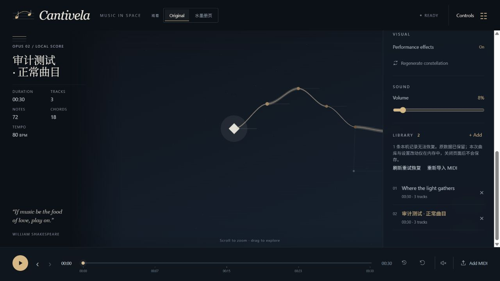
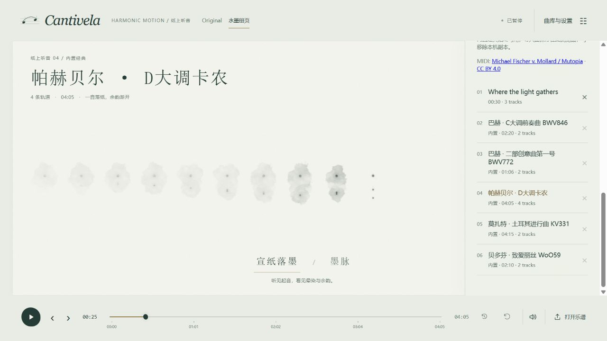

# 验证记录

Purpose: 保留带日期、baseline 和适用边界的实际检查证据。
Authority: 已发生验证的记录；不能作为未来提交自动通过的保证。
Update when: 新一轮检查产生结果，或旧证据被确认需更正。
Last verified: 2026-10-07；最新证据见 Built-in classics，早期记录保留其日期和适用边界。

日期：2026-09-17。环境：Windows、Node.js 24.18.0、Codex 内置 Chromium 浏览器，1280 × 720。

以下 Foundation 自动检查与浏览器记录来自产品基线 `db67599` 的建立过程。本轮 documentation-only 任务没有重跑浏览器、试听或演奏用户 MIDI；新增证据在文末。

## 自动检查

- `npm run test`：31 项测试，覆盖音乐数据、确定性、端点、seek、播放协调和音频调度。音频适配器测试使用 Tone mock 验证参数、独立声部与取消操作，不等同于声卡输出测试。
- `npm run lint`：ESLint，零警告阈值，包括核心模块依赖约束。
- `npm run build`：strict TypeScript + Vite 生产构建。

生产主包约 1.38 MB（gzip 373 KB），Vite 给出超过 500 KB 的体积提示。当前所有功能在本地一次加载；后续面向公网交付时可拆分音频与 3D 依赖。

## 浏览器交互

| 检查 | 观察 |
| --- | --- |
| 默认加载 | 显示原创短句、8 节点、连接、1 Performer、seed 107 |
| Play | 音频解锁成功，状态变为 Performing，时间增长，和弦标签随歌曲变化 |
| Restart → Pause | 进度回到开头，暂停后时间冻结 |
| 暂停 seek 到 5.4s | 标签恢复 C4 · E4 · G4，Performer、节点和命中光环显示在对应位置 |
| Effects off | 反馈关闭，时间保持 5.4s |
| Regenerate | seed 107 → 108，时间仍为 5.4s，乐谱不变 |
| 双轨变速 MIDI 导入 | 24 notes、12 chord nodes、2 voices，加载后归零，并可播放/暂停 |
| 无效 MIDI 导入 | 显示明确格式错误，原乐谱、世界和暂停进度保持 |
| 浏览器错误 | 以上流程未发现 console error |
| 生产构建预览 | 在独立 preview 服务加载成功；从 5.4s 和弦延音处 Play / Pause 成功，未发现 console error |

浏览器曾记录 Three.js 关于内部 THREE.Clock 的弃用警告（来自渲染库），不参与项目音乐时钟。截图人工检查确认 3D Canvas 正常绘制；无 WebGL 的浏览器会显示降级提示。

## 仍需人工确认

音频接口和调度已通过代码测试和浏览器启动检查；本次没有采集声卡输出或真人听音，不将这些检查视作音质、听感或端到端音画延迟测量。复杂真实曲目、超密集 MIDI 与后台长期播放尚未作为性能基准测试。

## Repository Operating System baseline · 2026-09-17

产品起点：`db67599`。本轮完整审阅 40 个 src 文件、4 个测试文件、三份原有文档及 package/build/lint 配置；没有审阅第三方依赖全集。仅为核实 MeshBasicMaterial 的光照行为定向读取其安装源码说明。

| 检查 | 本轮结果 |
| --- | --- |
| `npm run test` | PASS，4 文件 / 31 测试 |
| `npm run lint` | PASS，零 ESLint 警告 |
| `npm run build` | PASS，strict TypeScript + Vite；既有 bundle-size warning 保留 |
| 生产资源 | JS 1,375.62 kB，gzip 372.59 kB；CSS 5.87 kB，gzip 1.96 kB |

build 只重新生成被忽略的 dist/与 TypeScript 缓存；没有修改构建配置或依赖。命令用法和缺失覆盖见 [TEST_MATRIX](TEST_MATRIX.md)，本轮识别的差异见 [KNOWN_LIMITATIONS](KNOWN_LIMITATIONS.md#documentation-drift)。

### 文档验收

- 18 份 Markdown 文档（新增 15、更新 3）均有 freshness metadata；根 AGENTS 为 106 行。
- 本地链接及锚点检查通过；zoom/pan、InkTheme、新 GeometryStrategy 的导航能到达真实模块、源码与验证入口。
- 定向命令 `npm run test -- tests/engine.test.ts -t "Independent extension points"` 已实际运行：3 项通过、12 项按过滤条件跳过；完整 31 项基线结果见上表。
- Git 差异及暂存文件逐项检查，只包含 Markdown；相对产品基线没有源码、测试、依赖或配置变更。用户已有的 `midi/` 未提交文件保留在此次变更之外。
- 已记录视觉配置的实现差异和 seek 文案澄清；没有为解决差异修改产品代码，也没有编造历史 plan/ADR。

## Iteration 02 · Visual Readability and Performance Narrative

日期：2026-09-17。产品起点：`769bc55`。

| 检查 | 结果 |
| --- | --- |
| `npm run test` | PASS，5 文件 / 38 测试；新增 7 项 presentation/camera/store 回归 |
| `npm run lint` | PASS，零 ESLint 警告 |
| `npm run build` | PASS；JS 1,400.14 kB（gzip 379.59 kB），CSS 8.79 kB（gzip 2.79 kB）；既有 >500 kB warning 保留 |
| 浏览器 console | 无 error；只有既有 Three.js Clock deprecated warning |

浏览器检查了内置 10 音符 demo，以及临时程序生成的 4 轨/720 音符/约 14.5 秒 MIDI（132 BPM；不写入仓库）。实际观察：

- UI 作品信息、实时音符/声部、timeline、view/visibility/fit/effects 控件在 675 px 宽窗口仍可读。
- Constellation 的 Overview/Focus/Current Path 可切换；密集曲目中 Focus 最多强调 96 节点，Current Path 最多 36 节点，当前路径保持清楚。
- Stream 在 demo 和密集曲目中只显示局部绝对时间窗口；和弦时显示多个卫星，pitch 上下分布，主 Performer 保持突出。
- 暂停后 seek 到 5.2 秒恢复 demo 的 C4/E4/G4 和弦；播放中切换 view 保留歌曲时间，未重新加载 MIDI。
- 对 Canvas 执行 wheel、drag 与 Fit World；world/plan/playback 不由相机交互修改。自动测试另验证 compiled/world/plan 引用严格不变。

未测量 FPS、GPU 时间、真实声卡输出或端到端音画延迟；720 音符截图证明局部化策略可用，不是性能承诺。

## Iteration 03 · Musical Identity, Relation Language & Multi-Score Experience

日期：2026-09-18。产品起点：`5b67149`。Windows / 内置 Chromium；开发服务上的实际 WebGL 交互，生产构建另行检查。

| 检查 | 结果 |
| --- | --- |
| `npm run test` | PASS，7 文件 / 49 测试（14:46）；含显著性、音乐输入派生主线、随机 seek、生命周期、关系、取景、会话引用缓存等回归 |
| `npm run lint` | PASS，零 ESLint 警告 |
| `npm run build` | PASS（14:47）；strict TypeScript + Vite；JS 1,412.69 kB / gzip 383.38 kB，CSS 10.70 kB / gzip 3.24 kB |
| 定向复验 | 测试 fixture 补齐必须的 name/instrument 后，musical-presentation 10 项通过；修正仅涉及测试数据 |
| 浏览器 console | 无 error；已有 Three.js Clock 弃用提示和构建 >500 kB 提示仍保留 |

过程中 build 曾指出新增测试 fixture 缺少必需字段；Vitest 转译通过不代表 strict TypeScript 通过。补齐 fixture 后重新构建和定向测试通过，没有忽略该错误或降低类型约束。

### 实际浏览器结果

- 默认舞台、Cantivela SVG 字标、作品铭牌、可靠曲目统计、引语和默认关闭的控制抽屉均正常显示。1280 × 720、900 × 740、640 × 760 已观察；窄屏控制抽屉可滚动。
- 抽屉打开后焦点移入，Escape 关闭后返回 View 按钮；关闭时内容 inert。初次焦点检查暴露 CSS visibility 的时序问题，已移除该冲突并复验。reduced-motion 样式已检查，未做操作系统偏好切换的端到端测试。
- Constellation 显示主关系、序列、声部及和弦局部成员。720 音符样本中 Focus / Current Path 减少显示内容，但稠密交叠仍存在，不声称已解决所有谱面的可读性。
- Stream 的 Ribbon / Helix 在 demo、双轨变速样本和 4 轨 / 720 音符临时样本上观察；主角沿主线运动，伴随组与长音有绝对时间生命周期。初次逐起音选主线导致密集金色折返，改为短时间窗显著性选择并加入交错起音回归。
- 相机 wheel / drag 前后截图确认缩放和平移真正生效，等待界面更新后保持，Fit 恢复。定位到 R3F size 对象更新触发重复取景，依赖改为 width/height 后修复。**Iteration 02 的“执行 wheel/drag”只证明发出了操作，不能证明导航保持有效；以本轮结果更正该证据边界。**
- Stream 暂停 3 秒处 Fit stage 没有跳回开头；跟随与手动浏览可切换。播放中切换视图时间由 3.04 秒继续到 3.98 秒；暂停后时间冻结。
- 多选导入双轨变速样本和密集样本，曲库增加至三首；双轨样本显示 24 notes / 12 chords / 2 tracks / 80–120 BPM。播放中切曲停止并归零；删除非当前曲不改变当前曲，删除当前曲回退到剩余曲。
- Helix、Effects off 等显示偏好切回和删除后保持。缓存复用的严格引用相等由 session 测试证明；仅凭 UI 切回不推断缓存是否命中。
- 无效 MIDI 在暂停 4.037 秒处导入失败后保留原曲、显示和进度，并显示错误；多文件导入允许成功项保留。用户自带 MIDI 没有打开、修改或纳入验证素材。
- 同一 songTime 往返 seek 的两幅截图对比：音乐舞台像素一致；整图有 1,454 像素差异，局限于右下音符标签的颜色过渡区域（1184,512–1280,592），最大通道差 13。因此不宣称整帧逐像素一致。

本地截图：`artifacts/iteration-03/stream-helix.png`；该目录按现有规则忽略，不作为 Git 中永久可用的证据附件。测试 fixture 可复用；720 音符文件只保留在临时目录。

### 适用边界

显著性是可配置启发式，不是真实旋律提取；伴随短组也不是音乐学乐句识别。未采集真实声卡输出、试听音质、测量音画延迟/FPS/GPU 时间或 20,000 音符压力。浏览器检查使用开发服务，未把本轮生产构建通过写成生产浏览器复测。已知后续项见 [KNOWN_LIMITATIONS](KNOWN_LIMITATIONS.md)。

交付范围检查：21 份 Markdown / 278 处本地链接与锚点检查通过，`git diff --check` 及暂存差异检查通过。实现提交 `a8f5319` 的 35 个文件已复核；用户 `midi/` 仍为未跟踪素材且 SHA256 未变化。计划登记该提交后归档，GitHub 上传另行核实。

## Windows one-click launcher and process cleanup · 2026-09-22

日期：2026-09-22。产品起点：`12cb5b7`。本轮只增加 Windows 启动入口和宿主进程清理，不修改应用运行时代码、依赖或构建配置。

| 检查 | 结果 |
| --- | --- |
| PowerShell 语法 | PASS；`scripts/start-harmonic-motion.ps1` 可解析 |
| `.cmd` 入口 | PASS；`start-harmonic-motion.cmd -NoBrowser` 可启动并在退出后释放 5174 |
| 受控启动 | PASS；`-NoBrowser` 启动 Vite、等待 HTTP 响应，退出后 5174 释放 |
| Edge 启动生命周期 | PASS；真实 Edge 独立 profile 被创建，启动器结束后 5174 释放且 `harmonic-motion-*` 临时 profile 清除 |
| `npm run test` | PASS，10 文件 / 74 测试 |
| `npm run lint` | PASS，零 ESLint 警告 |
| `npm run build` | PASS；strict TypeScript + Vite；既有 >500 kB 提示保留 |
| `git diff --check` | PASS；用户未跟踪的 `midi/` 未进入本轮文件 |

一键入口为根目录的 `start-harmonic-motion.cmd`，实际逻辑在 `scripts/start-harmonic-motion.ps1`。启动器只在确认端口空闲后绑定 5174；关闭独立 `--app` 窗口后通过浏览器 profile 生命周期清理服务进程和临时目录，不把普通浏览器标签页当作关闭信号。当前 CUA 浏览器枚举返回 `nodeRepl.fetch` 错误，因此没有把外部 Edge 窗口截图或 UI 可见性写成已验证证据；宿主进程、HTTP、端口和临时 profile 生命周期已实测。入口使用 ASCII 文件名，以兼容 Windows `cmd.exe` 代码页。

## MIDI text encoding compatibility · 2026-09-20

日期：2026-09-20。产品起点：`08633e7`。先完整撤销未提交的 Iteration 04 UI/preset 修改，再只修复 MIDI 文本规范化、回归测试和必要文档。

| 检查 | 结果 |
| --- | --- |
| 定向测试 | PASS，`tests/midi.test.ts` 1 文件 / 8 测试；新增 GB18030 标题/轨道名与 ASCII 标题回归 |
| `npm run test` | PASS，7 文件 / 51 测试 |
| `npm run lint` | PASS，零 ESLint 警告 |
| `npm run build` | PASS；JS 1,413.54 kB / gzip 383.67 kB，CSS 10.70 kB / gzip 3.24 kB；既有 >500 kB 提示保留 |
| 浏览器 console | 无 error |

实际文件 `帕赫贝尔D大调卡农.mid` 的标题元事件字节为 `C5 C1 BA D5 B1 B4 B6 FB 44 B4 F3 B5 F7 BF A8 C5 A9`；依赖原始输出为 `ÅÁºÕ±´¶ûD´óµ÷¿¨Å©`，GB18030 严格解码与正常文件名共同确认标题为“帕赫贝尔D大调卡农”。浏览器只读导入后可见标题精确匹配，原乱码未出现，并显示 05:02、1 track、1,956 notes、617 chords。没有启动音频播放，因此本次证据不涉及听感或端到端音画延迟。

用户 `midi/` 保持未跟踪，不进入提交；修复不改写文件，不触碰 UI、视觉、geometry、choreography、playback 或 audio。

## Complex music readability, Ensemble stage & render budgets · 2026-09-21

日期：2026-09-21。产品起点：`b189533`。本轮扩展显示层，未修改 MIDI、geometry、choreography、playback 或 audio 核心模块。

| 检查 | 结果 |
| --- | --- |
| `npm test` | PASS，10 文件 / 74 测试 |
| `npm run lint` | PASS，零 ESLint 警告 |
| `npm run build` | PASS；JS 1,425.86 kB / gzip 387.41 kB，CSS 10.70 kB / gzip 3.24 kB；既有 >500 kB 提示保留 |
| 规模快照 | 100/700/2000/5000 notes 的 compile 1.19/2.13/4.83/6.93 ms；Ensemble 准备 0.39/0.37/0.93/2.02 ms；Ensemble seek P95 0.135/0.105/0.212/0.103 ms |
| 数据不变 | world JSON 41945/310377/895622/2254588 bytes，plan JSON 52108/390249/1124446/2827599 bytes，与前次快照一致 |
| 浏览器 | 1280×720 开发服务检查 demo、700、2000 和高速 2000；Ensemble 5 draw calls、约 100 个实例，120 帧窗口中位约 6.1 ms；刷新后的 console error 为空 |
| 播放切换 | 播放中 Ensemble→Stream→Constellation→Ensemble，进度连续，audio load 计数保持不变；Ribbon 为正面镜头 |

Ensemble 保持各轨道的稳定弧区，按发声状态、主线显著性、时长和音高轮廓在每声部中选择代表，并抑制同声部近距离重叠。省略只发生在绘制集合，完整 score/world/plan 和音频仍保留。浏览器截图和开发指标不是通用 FPS、GPU 内存或真实声卡延迟承诺；未使用用户 `midi/` 素材作为本轮测试数据。

## Radial Stage inner-to-outer depth emergence · 2026-09-21

日期：2026-09-21。基于 `5f29b5b`，只扩展 Ensemble/Radial Stage 的 presentation、render、camera staging 与显示生命周期。

| 检查 | 结果 |
| --- | --- |
| `npm test` | PASS，10 文件 / 74 测试 |
| `npm run lint` | PASS，零 ESLint 警告 |
| `npm run build` | PASS；JS 1,427.73 kB / gzip 388.08 kB，CSS 10.63 kB / gzip 3.21 kB；既有 >500 kB 提示保留 |
| 定向生命周期 | PASS；Hidden、Emerging、Approaching、Active、Fading 的阶段、内外半径、深度、弧形路径、seek 结果均确定 |
| Node 性能快照 | 100/700/2000/5000 的 Ensemble 准备 0.85/1.53/2.08/4.50 ms；Ensemble seek P95 0.156/0.110/0.184/0.092 ms；world/plan JSON 字节保持原值 |
| 浏览器 | 1280×720 开发服务检查 700、2000 和起始深处状态；中心深层小音符、弧形向外丝线、外层活跃结构均可见，5 draw calls，700 样本约 103 实例，console error 为空 |

阶段是纯 songTime 求值：预备音符从内层小尺度/低亮度/负 z 深度进入，接近时沿带弧度路径向外展开，活跃时在声部弧区共鸣，结束后短暂松开并淡出。没有固定判定圈、命中线、评分或输入玩法；完整音频和音乐数据不受显示省略影响。截图和帧间隔只说明本地开发环境表现，不构成跨设备 FPS 或音画延迟承诺。

## First Experience · Quick Study and first entry · 2026-09-26

日期：2026-09-26。产品起点：`835459a`。默认乐谱使用仓库内原创音符序列，无外部 MIDI、采样、字体或新增依赖；用户未跟踪的 `midi/` 与产品计划 `.docx` 未修改。

| 检查 | 结果 |
| --- | --- |
| 定向测试 | PASS，`quick-study`、`session`、`engine`、`playback` 共 4 文件 / 30 测试；Quick Study 覆盖时长、三轨依次加入、和弦变化、重复生成及默认会话 |
| `npm run test` | PASS，11 文件 / 76 测试 |
| `npm run lint` | PASS，零 ESLint 警告 |
| `npm run build` | PASS，含 `tsc -b`；最终 JS 1,429.66 kB / gzip 388.64 kB，CSS 12.18 kB / gzip 3.56 kB；既有 >500 kB 包体积提示仍在 |
| 浏览器 | 内置 Chromium 开发服务：默认标题、30.825 秒、3 轨 / 72 notes / 18 chords 与代码一致；首次入口与文件选择可用；Play 后 Performing 且时间推进；Pause 冻结，seek 到结尾显示 Complete；Stream 与 Ensemble 可切换，说明可关闭/重新打开 |
| 版面 | 1280×800、390×844 视口检查作品信息、首次入口和窄屏说明；初次宽屏检查发现入口与元信息重叠，已在首次状态收起次要元信息并复核两者间距约 166 px。WebGL 场景可见 |

`Open my MIDI` 已确认打开浏览器文件选择器；本轮未上传用户 MIDI，也未重新验证所有导入内容。开发者浏览器测试不能证明首次用户真的理解音乐，且没有真人试听或声卡录音；听感仍受现有 sine Synth 限制。**Needs external user validation**：邀请 5–8 位陌生用户不经解释直接打开，记录首次播放用时、能否找到导入、能否指出焦点、是否听完整段及继续使用意愿。Milestone A 暂为部分完成。

## Listening Quality · default synthesis and sound controls · 2026-09-26

日期：2026-09-26。实施基线：`34f55a0`。在既有 Tone 适配器上加入自定义谐波与短起音/衰减，以及独立于播放声部生命周期的 master gain；底栏提供静音，Controls 抽屉提供音量。未修改 score、world、plan、clock、AudioEngine 接口或用户未跟踪素材。

| 检查 | 结果 |
| --- | --- |
| 定向 `audio` + `playback` | PASS，2 文件 / 11 测试；mock 验证合成配置、主增益、静音/音量与 seek/pause/load 后保持 |
| `npm run test` | PASS，11 文件 / 77 测试 |
| `npm run lint` | PASS，零 ESLint 警告 |
| `npm run build` | PASS，含 `tsc -b`；JS 1,431.10 kB / gzip 389.09 kB，CSS 12.67 kB / gzip 3.66 kB；既有 >500 kB 提示仍在 |
| 浏览器交互 | **部分通过**：本地 Chromium 在默认曲核对 Play/Pause、播放中/暂停时 seek、Restart、40% 音量、Mute/Unmute、静音时歌曲时间继续、Constellation→Stream→Ensemble→Constellation 切换后时间和控制值保持。390×844 窄屏关键按钮坐标均落在视口内；浏览器截图可见 WebGL 场景。导入第二曲的文件选择器未能在自动化环境中打开，切曲时的真实输出仍待验证 |
| 真人试听 | **Needs human listening validation**：本环境没有可用的声卡听感证据；音色质量、爆音/残留与跨设备音量表现均未确认 |

此处的 “piano-like” 仅描述合成设计方向，不代表采样钢琴或经试听证明的钢琴真实感。浏览器控制连接初次失败，重启本地开发服务后恢复；切曲自动化仍未完成。Milestone B 保持 Active；下一步用仓库测试 MIDI 核对切曲，再由实际听众记录设备、浏览器及具体段落。

## Continuity and follow-camera zoom · 2026-09-27

实施基线 `c8e2475`。IndexedDB 保存规范化乐谱及少量偏好，重新打开时调用既有编译流程，默认暂停；Windows 独立窗口改用稳定应用专用 profile，关闭仍回收自身进程。CameraRig 只在用户平移目标点时退出 Follow，缩放保持 Follow。用户授权本轮使用其 `midi/` 做本机验证；源文件没有修改或进入版本控制。

| 检查 | 结果 |
| --- | --- |
| 定向测试 | `session`、`audio`、`visual` 共 3 文件 / 11 测试通过；新增恢复两首乐谱、唯一 ID 延续以及切曲后旧声部清理/主增益保持断言 |
| `npm run test` | PASS，11 文件 / 78 测试 |
| `npm run lint` | PASS，零 ESLint 警告 |
| `npm run build` | PASS，含 `tsc -b`；JS 1,435.12 kB / gzip 390.37 kB，CSS 12.74 kB / gzip 3.67 kB |
| 浏览器曲库 | 内置浏览器导入双轨测试谱，设置 Stream、40% 音量、3 秒；刷新后曲目、暂停状态、时间和偏好均保留。导入用户授权的《帕赫贝尔D大调卡农》（1,956 notes）后中文标题正常，seek 至 1:30，刷新后标题和暂停位置保留；删除双轨测试谱并刷新，曲目没有复活。往返切曲归零而音量保留 |
| 浏览器镜头与画面 | Stream 和 Constellation 均在 Follow On 时滚轮缩放，画面比例改变且开关保持 On；Stream 拖动画布后变为 Off。卡农的 Constellation/Stream 画面正常绘制，浏览器捕获的 error 日志为空 |
| 启动器 | PowerShell 语法检查及 `-NoBrowser` 启动/清理通过；专用 Edge 窗口两次启动并关闭后脚本均正常退出，5176 端口释放，`%LOCALAPPDATA%\HarmonicMotion\Profiles\msedge` 目录保留，锁文件消失，第二次能复用该目录 |

验证边界：内置浏览器完成了真正的导入、刷新恢复和删除回归；外部 Edge 启动后浏览器自动化连接中断，因此没有逐项核对它第二次打开后的页面曲库内容，也没有本轮 390 px 新截图。启动器的稳定目录和进程生命周期已实测。用户反馈当前音色可接受，但本轮没有声卡信号采集、跨设备试听或端到端延迟测量；不将主观反馈视作音质认证。

## Musical legibility · choose a part to follow · 2026-09-27

实施基线 `07a4f38`。轨道选择只进入只读 presentation、三种 renderer 和 App 的逐曲本机偏好；没有修改 MIDI、domain score、geometry、choreography、playback 或 audio。用户授权的《帕赫贝尔D大调卡农》在浏览器已保存曲库中只读使用，`midi/` 源文件未修改或提交。

| 检查 | 结果 |
| --- | --- |
| 先写失败测试 | 指定轨道主线及密集显示预算的新增断言在实现前失败，完成后通过 |
| `npm run test` | PASS，11 文件 / 80 测试；包括 Auto 回归、无效轨回退、指定轨主线、其他轨保留和密集段预算 |
| `npm run lint` | PASS，零 ESLint 警告 |
| `npm run build` | PASS，含 `tsc -b`；JS 1,437.43 kB / gzip 391.17 kB，CSS 13.12 kB / gzip 3.76 kB；既有 >500 kB 提示仍在 |
| `git diff --check` | PASS；未跟踪的 `midi/` 与产品计划 `.docx` 保持排除 |
| 浏览器交互 | 三轨 Quick Study 的 Auto→Bass→Harmony→Melody，Constellation/Stream/Ensemble 切换、12 秒 seek、播放中改焦点、暂停与刷新均正常；焦点按曲目隔离，切到单轨卡农为 Auto，返回示例仍记得选择。播放中时间从约 17.6 秒继续到 21.1 秒，没有归零；卡农中文标题正常 |
| 浏览器画面 | 1280×720 截图确认三视图真实绘制：Stream 暖色主线与低对比伴随组、Constellation 焦点关系与背景节点、Ensemble 焦点音符与其他声部弧区均可见；初次背景过暗后将上下文亮度提高并复看。390×844 的抽屉/选择器完整可见且可滚动；浏览器 error 日志为空 |

上述交互说明焦点切换没有重置浏览器歌曲时间；代码检查确认 App 不改变 compiled score/world/plan 引用，音频加载 effect 只依赖 score。它不等同于真实声卡听音或对任意多轨作品的语义判断。浏览器可访问性树列出 Canvas fallback 文案，但同次截图实际有 3D 绘制，因此以截图判断画面；外部 Edge 自动化连接失败，视觉检查使用内置浏览器。测试后已恢复原曲《帕赫贝尔D大调卡农》、Auto、Stream、原 Follow Off 和 00:00。未上传 GitHub，等待用户验收后决定。

## Long-session Comfort · viewing controls · 2026-09-27–28

实施基线 `9763f48`。新增 UI 的全屏、少量键盘操作及最近 10 秒重听；按用户后续纠正将 Stream 恢复为 Helix 细曲线，去掉宽带面。复用既有 controller，不修改音乐核心、相机或显示模型。用户素材和产品计划 `.docx` 保持未跟踪，不进入提交。

| 检查 | 结果 |
| --- | --- |
| 定向 playback + audio | PASS，2 文件 / 12 测试；最近片段回退在播放中保持 playing，暂停时退至 0 后可恢复，音频只加载一次 |
| `npm run test` | PASS，11 文件 / 81 测试 |
| `npm run lint` | PASS，零 ESLint 警告 |
| `npm run build` | PASS，含 `tsc -b`；最终 JS 1,439.08 kB / gzip 391.70 kB，CSS 13.28 kB / gzip 3.78 kB；既有 >500 kB 提示保留 |
| 文档与差异 | PASS，本轮 7 份 Markdown 的 116 条本地文件链接均可解析，`git diff --check` 通过。全仓扫描另发现旧 launcher plan 的 `../TEST_MATRIX.md` 链接失效，基线已存在，未在本轮修复 |
| 浏览器控制 | 内置 Chromium：舞台 Space 播放/暂停、←/→ 5 秒、R 重听、底栏重听按钮在暂停/结束时从回退点播放；Quick Study 的 5 秒回退正确钳制到 0；时间滑杆 ArrowRight 从 0 到 5 秒。音量滑杆方向键只把 40% 调至 41% 再回 40%，没有触发歌曲 seek |
| 全屏 | 按钮与 F 可进入/退出；内置浏览器的原生 Escape 未自动退出，故 UI 明确调用退出，复测成功。连续播放中 2:23→2:48 的全屏进出没有归零 |
| 长曲连续性 | 2026-09-28：卡农 1,956 notes / 302 秒，从 Restart 后 0 连续运行至 05:02 / Complete，中途没有 seek 或 pause。Stream Follow On 的中段画面可见；后台空白标签约 51 秒返回时从 1:24 推进至 2:15；Stream→Ensemble→Constellation→Stream 期间 3:06→4:08 时间连续 |
| 画面与窄屏 | 390×844 的 transport 无横向溢出；时间轴刻度标签因拥挤而隐藏，当前位置、总时长和滑杆保留。桌面与全屏截图确认 WebGL 和当前结构实际绘制；浏览器 error 日志为空，Three.Clock 既有弃用警告仍在 |
| Stream 最终线形 | 参照历史 Helix 的细曲线，仅删除宽带面 mesh 与生成缓冲；保留既有曲线采样、支持线、时长线、节点和焦点。卡农 20 秒截图可见主线/伴随线，未出现水平引导线；Play 从 20 到约 26 秒，R 回退到约 16 秒继续，再暂停到约 22 秒。最终 error 日志为空 |

2026-09-27 初次长曲检查约 1:32 曾出现空画面；代码与偏好复核表明当时 Follow Off，固定镜头不会追踪持续前移的 Stream。Fit stage 开启 Follow 后恢复；2026-09-28 在 Follow On 下完成整曲，不将该观察误记为跟随计算故障，也没有为此修改 camera。整曲验证在最后删除宽带面之前完成；删除后单独复测了截图、播放/重听，并重跑全量 test/lint/build，没有声称再跑一遍完整长曲。自动检查与浏览器控制不能证明真实声卡输出或长期观看疲劳；尚无真人舒适度评价，未据此新增 Calm/Normal 或循环播放。

## Stream line experiments rollback · 2026-09-28

基线 `8c9cfd3`。用户要求撤销水平引导线与 Helix 细线两次试改；前者未进入最终提交，后者通过恢复 `9763f48` 的完整 `StreamRenderer.tsx` 撤销。恢复 Ribbon 主线面与线条，保持新全屏、快捷键、重听功能及现有 camera、presentation、音乐核心。旧验证和提交记录保留为历史证据。

| 检查 | 结果 |
| --- | --- |
| 恢复精确性 | 当前文件 blob 与 `9763f48:src/render/StreamRenderer.tsx` 均为 `d911059af053415c68c3f8b0d2853d2fe2849a42`；唯一源码差异是该文件 |
| `npm run test` | PASS，11 文件 / 81 测试 |
| `npm run lint` | PASS，零 ESLint 警告 |
| `npm run build` | PASS，含 `tsc -b`；JS 1,439.85 kB / gzip 391.91 kB，CSS 13.28 kB / gzip 3.78 kB；既有 >500 kB 提示仍在 |
| 文档与差异 | PASS，本轮 5 份 Markdown 的 79 条本地文件链接可解析，`git diff --check` 通过 |
| 浏览器 | 卡农暂停于 126.009 秒，由 Ensemble 切至 Stream 后时间保持；截图确认 Ribbon 主线面及伴随结构绘制。播放继续至约 194.635 秒，再暂停并 seek 回 126.009 秒；error 日志为空 |
| 用户状态 | 核对后恢复 Ensemble、原暂停位置、Auto、40% 音量及关闭的 Controls；未导入或删除曲目，未触碰用户未跟踪素材 |

本次为局部撤销，没有重跑此前 302 秒整曲或真人试听；回退只影响绘制外观。产品路线图的下一阶段仍是 Capture & Share，仓库保留 Deferred 状态；本次说明下一轮候选，不据此启动新功能开发。

## Ink Stream and coordinated UI · 2026-09-28

实施基线 `1861bc4`，执行用户已认可的水墨 Stream 计划。新增纯视觉类型、Ink preset、独立批量 renderer、本地纸面淡景 SVG、绝对时间墨迹和一份本机风格偏好。Original / Ink 同步切换舞台与外围界面，仅在 Stream 生效。没有修改 MIDI、分析、geometry、choreography、playback、audio、CameraRig 或 musicalPresentation；用户素材未改写或提交。

| 检查 | 结果 |
| --- | --- |
| 原版保留 | `StreamRenderer.tsx` blob 仍为 `d911059af053415c68c3f8b0d2853d2fe2849a42`，与撤销线条试改后的基线完全相同 |
| 定向检查 | Ink / visual / session / engine 共 31 项先通过；追加资源缓存/失败重试后 Ink suite 8 项通过 |
| `npm run test` | PASS，12 文件 / 89 测试；包括同 compiled/world/plan、共享 camera/presentation、效果关闭保留、密集预算、随机 seek 与生命周期边界、version 1 风格缺失/未知值局部回退、资源缓存/重试 |
| `npm run lint` | PASS，零 ESLint 警告 |
| `npm run build` | PASS，含 `tsc -b`；JS 1,452.12 kB / gzip 396.05 kB，CSS 18.03 kB / gzip 4.51 kB；既有 >500 kB 提示保留 |
| 舞台与 UI | 1280×720 对照原版与 Ink：纸面、边缘淡景、墨心、叶形辅助笔触、主笔势和朱色运笔主角实际绘制；页头、中文标题/作品数据、Controls/曲库、transport 与焦点框同步换肤，无旧黑色遮罩。三轨 Quick Study 可选择 Harmony，其他声部仍可见；卡农中文标题正常 |
| 实曲密集段 | 只读使用已授权卡农（1,956 notes / 302 秒）与《土耳其进行曲》（8 tracks / 2,833 notes / 789 同时起音组 / 203.64 秒）。后者最高 2 秒窗口为 42 notes，检查 179.2 秒：主线、和弦墨心、辅助关系和长音方向仍可读，没有大片扩散团遮盖结构；加入当前浏览器曲库，源 MIDI 保留未跟踪 |
| 时间与资源 | 卡农从 0 连续演奏至 186.045 秒，随后三视图往返、暂停至 200.696 秒；水墨连续段超过 3 分钟，没有 seek/pause。播放中 Original / Ink 往返 20 次，时间继续推进，水墨恢复 4 geometries / 0 GPU textures，资源未随次数增长 |
| 音频与相机 | 临时观察记录显示 20 次换肤期间没有新增 `controller.load` 调用；切曲/刷新才出现对应加载。缩放后 Original 与 Ink 的相机 position/quaternion 完全相同，距离从原取景约 17.7556 改为约 17.1118 后保留。观察代码已删除，最终版本不含调试 API |
| 手动平移与最终恢复 | 手动平移后 Original→Ink 的前后完整截图 SHA-256 相同，取景未重置。最终版本刷新恢复卡农、Ink、126.009 秒暂停、Auto、40% 音量与 Effects On；静音恢复为 Off，Controls 关闭，error 日志为空 |
| 暂停 / seek | 土耳其进行曲暂停 179.2 秒的两次完整截图 SHA-256 相同，未累积墨迹；12 秒→179.2 秒前后 seek 可重建同一音乐结构，纯求值断言通过。seek 截图不宣称逐像素相同，时间滑杆焦点框会变化 |
| 关闭装饰 | Performance effects Off→Original→Ink 后仍为 Off，核心墨心与笔势保留，余韵/尾迹停用。reduced motion 使用既有挂载检查关闭相同标志，CSS 去除过渡；本轮没有改动操作系统偏好 |
| 窄屏 / 键盘 / 全屏 | 390×844 的风格入口位于 View 下方，两个按钮高度均为 44px，文档 scrollWidth/clientWidth 同为 390；抽屉可滚动。Enter/Space 切换不触发播放；既有 Fullscreen 按钮显示 Exit full，退出回到窗口布局 |
| 加载回退 | 测试期延迟本地 Image 完成：Ink 显示 Preparing ink，舞台/UI 保持 Original；立即改回 Original，过期完成不覆盖选择。测试期给第一张 Image 无效 SVG：保留 Original 与 12 秒暂停位置，显示重试提示；再次选择 Ink 成功且提示清除。延迟/故障注入已全部删除，资源缓存与失败重试另有单测 |

同浏览器、1280×720、土耳其进行曲暂停 179.2 秒、相同镜头/效果的热状态 `?benchmark` 对照（各最近 120 个绘制样本）：

| 指标 | Original | Ink |
| --- | ---: | ---: |
| frame median / P95 ms | 6.0 / 12.0 | 5.6 / 12.9 |
| draw calls | 8 | 4 |
| triangles / lines | 19,132 / 1,286 | 2,660 / 0 |
| geometries / GPU textures | 7 / 0 | 4 / 0 |
| 活跃 instances / 容量 | 120 / 142 | 125 / 257 |
| CPU buffers bytes | 458,352 | 1,269,296 |

Ink 的 P95 在这次有限样本中增加 7.5%，median 下降约 6.7%，符合计划中约 20% 的热状态退化阈值。额外实例容量来自有限的墨团与笔锋，CPU 缓冲约增加 0.81 MB；不会随歌曲时长增加。此前后台/隐藏窗口样本约 1,000ms，受浏览器节流影响，不混入这个对照。这些数据不是 GPU 计时或跨设备 FPS 保证，未进行声卡测量、真实压缩视频录制或真人长期舒适度评价。

本地截图和性能 JSON 保存于忽略的 `artifacts/ink-stream/`，不将用户音乐或测试临时观察代码上传。最终偏好恢复和文档链接检查见实施计划的完成记录。

## Ink folio integration · 2026-10-01

实施基线 `8c96ed2`。按用户提供的水墨古韵集成说明，将独立研究的宣纸落墨与墨脉接入主站；研究 Demo 保持独立。替换旧 Ink 专用 renderer、引导线/主角表达和淡景背景，新增只读纸面投影及配套册页 UI。音乐引擎、播放、音频和原版 StreamRenderer 未修改。用户 MIDI 与非版本化产品文档不提交。

| 检查 | 实际结果 |
| --- | --- |
| 自动检查 | 最终 `npm run test`：12 files / 90 tests；`npm run lint`：零 warning；`npm run build`：通过 TypeScript 与 Vite。水墨 suite 9 项，包含真实事件范围、休止、力度/时值/重复叠墨、和弦、长音、空谱、密集预算与 seek 确定性 |
| 构建快照 | JS 1,456.25 kB / gzip 398.53 kB；CSS 23.23 kB / gzip 5.66 kB。既有大于 500 kB 的 chunk 警告保留，未扩大范围拆包 |
| 状态边界 | 单测的 20 次模式/风格/视图切换保持 compiled/world/plan 以及 camera/presentation 配置引用；mock audio load 只有首次一次。App 的音频加载仍只依赖原 score，切换不调用 load/seek/compile；这不是声卡输出测量 |
| 浏览器曲目 | 内置 Quick Study、用户卡农/土耳其进行曲，以及通过本地文件选择器导入的巴赫二部创意曲与 C 大调前奏曲；中文曲名正常，导入及切曲回到起点，旧本机曲库可恢复 |
| 视觉修正 | 实际检查后只连接短促奏法间隙，保留真实休止及大跳的抬笔；缩小和声墨域。主脉与支脉粗细/干湿不同；落墨保留墨芯、向外湿边与淡余墨，没有预绘引导线或移动 Performer |
| 连续性与资源 | 前奏曲播放中切换两种水墨 20 次，再 Original 往返，时间继续推进；暂停后额外 10 次 Original 往返（20 次风格切换），未见上下文数量警告。此记录不构成完整 GPU 内存泄漏测试 |
| seek 确定性 | 前奏曲暂停于 23.434 秒，截图纸面；键盘前进 5 秒后画面改变，返回 23.434 秒的纸面截图字节完全相同。真实拖动时间轴到 63.306 秒后画面更新，仍暂停 |
| 控件与原版 | 主线 Auto/指定轨道、墨晕开关、播放/暂停、重听十秒、Restart、切曲正常。Constellation/Ensemble/Stream 往返保持 63.306 秒，原版画面实际绘制。全屏入口/退出及键盘跳转、抽屉 Escape 关闭和焦点返回已检查 |
| 响应式与恢复 | 1440×960、1280×800 与 390×844 检查；窄屏无横向溢出，模式签、transport 与滚动抽屉可用。临时 viewport 已重置。最终刷新恢复前奏曲、Ink/veins、25 秒暂停、Auto、40% 音量及效果开启 |
| 控制台 | 未见 error；仍有既有 THREE.Clock deprecated warning。未修改相关依赖 |
| 文档与 diff | `git diff --check` 通过。检查 32 份 Markdown 的 375 个相对链接/锚点：本轮目标均可达；发现早已存在于 HEAD 的启动器完成计划 `../TEST_MATRIX.md` 相对路径错误，按局部改动规范保留，未顺手改写该历史计划 |

### 纯投影 CPU 样本

使用同一 `createInkPresentation` / `buildInkFrame`，每份曲目每个模式采样 90 个等距时间点，纸面 1300×600。下表仅测纯数据投影，**不包含 WebGL 绘制、GPU 时间、音频或视频录制**。

| 样本 | 音符 / 轨道 | 模式 | median / P95 (ms) | 峰值笔触 |
| --- | --- | --- | --- | --- |
| 卡农 | 1956 / 1 | drops | 0.073 / 0.164 | 154 |
| 卡农 | 1956 / 1 | veins | 0.184 / 0.464 | 919 |
| 土耳其进行曲 | 2833 / 8 | drops | 0.100 / 0.151 | 184 |
| 土耳其进行曲 | 2833 / 8 | veins | 0.285 / 0.737 | 2026 |
| 巴赫二部创意曲第一号 | 479 / 2 | drops | 0.029 / 0.104 | 96 |
| 巴赫二部创意曲第一号 | 479 / 2 | veins | 0.066 / 0.256 | 768 |

本地证据存于忽略的 `artifacts/ink-folio/`：`drops-canon.png`、`veins-bach.png`、`mobile.png` 和 `pure-frame-measurement.json`。未进行压缩录屏、跨设备听感或 GPU 帧率验收；WebGL2 失败提示/恢复有实现，但本轮未在真实失去图形加速的浏览器中强制验收。水墨使用独立自动纸面取景，保持原版镜头配置，不能据此承诺跨布局返回后手动镜头逐像素不变。

## Codebase audit · 2026-10-05

范围：用户授权全仓阅读与开发文档建设，明确不立即修改产品源码。基线 `e15cad575396607d01f2225529fbe6b9a75527ab`；Windows、Node 24.18.0、npm 11.16.0。沿用既有 docs，不新增产品实施 plan；审计的建议路线尚未执行。

| 检查 | 实际结果 / 证据边界 |
| --- | --- |
| 全仓范围 | 基线119个跟踪文件；58个src、16个tests/fixtures、31个docs、14个其余配置/脚本。读取第一方文本；lock结构核对；MIDI fixture解析。未跟踪用户midi/DOCX不编辑、不提交；不审计node_modules源码全集 |
| 正式自动检查 | `npm run test`：12文件/90测试通过；`npm run lint`通过；`npm run build`通过（含strict TypeScript）。未修改正式测试或配置 |
| 构建快照 | JS 1,456.25 kB / gzip 398.53 kB；CSS 23.23 kB / gzip 5.66 kB。Vite仍提示chunk >500kB，不将warning写成构建失败 |
| 依赖图 | 56个源码TS/TSX，176条本地import声明、95条type-only；忽略纯类型边后未发现第一方运行时import环。不是第三方依赖安全审计 |
| 受控复现 | 落墨重复音12秒后无mark、Ensemble淡出路径中间点跳变、Three旧boundingSphere裁剪错误、坏保存score被接受、部分恢复跳过记录、音频seek抛错后clock仍playing、IDB abort-only Promise未结束 |
| 稀疏长曲 | 实际小规模1音符/86401秒模型产生86403个energy元素；37字节MIDI经库与normalize得到134217728秒。未为极端输入分配大数组或运行浏览器，内存耗尽影响标为风险 |
| fixture | tempo-and-voices.mid经库与normalize得24notes/2tracks/8.1875秒；invalid.mid被拒绝；正式parser测试包含在全量suite中 |
| 诊断工具边界 | Node/Vite临时模块装载和audio/IDB mock，不写真实曲库、不新增产品文件；parser的SSR CommonJS互操作限制改用Node require加载库，不算产品缺陷 |
| 文档产出 | 根CODEBASE_AUDIT及8份developer手册；补README/索引/模块入口/测试缺口，纠正过期显示描述与历史启动plan链接，保留历史验证事实 |
| 本轮未做 | 浏览器视觉/真实IDB事务/多窗口覆盖/声卡/GPU/录屏/真人体验；未重跑一键启动关窗；未修复审计源码问题、未提交或推送GitHub |

问题的最小输入、观测值、位置与逐步路线统一见 [CODEBASE_AUDIT](../CODEBASE_AUDIT.md)；核心模块说明从 [开发者入口](developer/index.md) 开始。纯函数/受控mock复现不等于对应浏览器行为已经验收，也未成为正式回归覆盖。

文档检查：本轮共核对41份Markdown中的543条本地链接及Markdown锚点；文档metadata齐备。新增文档也做空白/冲突标记检查；`git diff --check`通过。最终范围仅Markdown，源码、tests、启动器、依赖/配置无Git差异，既有用户素材保持原样。

## Audit step 1 · Saved-score recovery and sparse-song memory · 2026-10-06

基线 `5ee4bda` 为上一轮审计/手册独立提交，产品源码基线仍为 `e15cad5`。本轮仅修复 A01/A02；修复提交 `f9e2900` 已上传 GitHub，范围及契约见 [归档计划](plans/completed/2026-10-06-audit-input-recovery.md)。参考 Dexie / R3F 的复现测试和语义提交方式，沿用本仓库工具链，不新增 CI、依赖或发布系统。

| 检查 | 实际结果 / 证据边界 |
| --- | --- |
| 先复现再修复 | 新回归在旧实现下暴露保存 score 校验、原值过滤与 duration 数组问题；先用有界样本断言稀疏类型，避免旧实现真的分配极端数组。复核时另用回归复现稀疏 note 数组空洞异常，并修复；没有弱化原用例 |
| 全量自动检查 | `npm run test`：13 文件 / **118 测试通过**；`npm run lint`：通过，零 warning；`npm run build`：strict TypeScript 与 Vite 通过 |
| 新覆盖 | session：缺 metadata、NaN/错误时长、乱序/空洞/重复 note、非法音高/力度、坏 track/chord/tempo、重复/未知版本/容器及好坏混合；persistence：unknown 原值保留、缺键与异常容器区分、正常保存恢复（IDB mock）；midi：有限 time+duration 溢出拒绝；ensemble：稀疏长曲、正常归一化/空桶插值 |
| 稀疏内存 | 正式测试实际解析 37 字节 Type 0 / PPQ=1 MIDI，duration=134217728 秒、1 音符；energy 为 Map、size=1，不按曲长分配。空谱、长音、密集谱及随机 seek 既有用例通过；不是整机内存/GPU 基准 |
| 构建快照 | JS **1,458.98 kB** / gzip **399.53 kB**；CSS **23.23 kB** / gzip **5.66 kB**。保留 chunk >500kB 的既有 warning，未扩大范围拆包 |
| 浏览器隔离 | Codex IAB、1280×720，独立 origin `http://127.0.0.1:5175/`；自建 fixture、真实 IndexedDB。原 4173/5174 曲库不用于故障注入。沙箱服务不可达后改为本机测试服务，不修改项目启动配置 |
| 好坏混合记录 | 正常曲目恢复，缺 metadata 的活动曲拒绝，回退 demo 的位置为 0（原 position=17 未套用）。关闭错误浮条后曲库仍持续提示临时状态，正常记录可选/播放；导入仓库 tempo-and-voices.mid 成功。切换视图/Ink 和临时导入后读取 DB：sessions 与 preferences 均和原值完全相同，坏记录仍存在 |
| 异常容器 | sessions=null 时提示恢复失败，刷新重试可重新进入页面；两键读取仍与原值完全相同，没有转为空库后写回 |
| 健康库保存恢复 | 正常活动曲从 5 秒暂停恢复；seek 到 8.083 秒并选 Ensemble 后离开页面，DB 保存该 position/view。重新打开恢复同曲、8.083 秒、Ensemble、暂停；sessions 值不变，preferences 按正常动作更新 |
| 视觉与切换 | 正常曲暂停于 13.845 秒，Constellation/Stream/Ensemble 及 drops/veins 画面实际绘制，切换保持该时间；37 字节极长曲在末段进入 Ensemble 并切换 Constellation/Stream/Ink，未冻结，保持134217727.5秒。UI快照包含 Canvas fallback 文本，实际截图确认3D绘制，未将 fallback DOM 当作故障验收 |
| 时间与音频边界 | 实际 Play 进入 performing、时间推进，Pause/seek 正常；source依赖核对与既有 mock 回归证明视觉动作不触发 compile/load/seek。浏览器测试静音，不声明真人听感、声卡延迟或调度失败恢复通过 |
| 控制台 | 未见 error；仍有既有 THREE.Clock deprecated warning，不在本轮升级相关依赖 |
| 文档与依赖 | 42 份 Markdown / 567 条本地链接及锚点可达；57 个源码 TS/TSX、181 条本地 import（96 条纯类型），无第一方运行时环；`git diff --check`通过 |

恢复保护界面（自建测试曲目）：

本地补充证据位于忽略的 `artifacts/audit-step-1/`：`mixed-retention.json`、`null-retention.json`、`healthy-save.json`、各视图 JPEG 和 `browser-fixtures.html`；测试 JSON 为 `artifacts/audit-step-1-full.json`。Vitest 首次受沙箱临时目录缺失影响，使用本命令进程内的 TEMP/TMP 指向忽略的仓库 artifacts 后执行成功，未改项目配置。

本轮不包含 abort/blocked/versionchange、多窗口覆盖、真实音频输出、GPU内存泄漏或跨设备性能验证；A03–A13仍开放。文档链接、diff 和 GitHub 交付状态在计划执行记录中保存。

## Built-in classics · 2026-10-07

Baseline: `d48df9b`；实现 `e2cbacc` 已推送 GitHub main；[完成计划](plans/completed/2026-10-07-builtin-classics.md)。新增五首 Mutopia 经典 MIDI，原字节、SHA-256、具体版本许可与转录者见 [来源记录](../src/demo/assets/SOURCES.md)。未上传用户 `midi/`、DOCX 或授权未明确的现代曲目。

- 一次全量 `npm run test`：14 文件 / 124 tests 通过；新增6项回归覆盖五份真实资产的完整音乐数据、HTTP失败、默认补齐不计入恢复数、保存内置 seed/score 优先、坏记录替补不激活和删除边界。
- `npm run lint`、`npm run build` 通过。生产主 JS 1466.97 kB / gzip 402.07 kB，保留既有超过500 kB的 chunk 提示；较小的 BWV772 资源按 Vite 默认规则内联，其余4份 MIDI 独立打包。未新增依赖或更改配置。
- 隔离的生产 preview `127.0.0.1:5176`、内置 Chromium、1280×720：初始仍为 Quick Study，引导保留，曲库共6项；逐首选择五首，中文标题、时长、轨道与音符数正确，未见错误提示，内置移除禁用。
- 卡农播放状态进入 Performing，时间增长至21秒；测试标签关闭后重新打开恢复卡农、暂停与20.176秒保存位置。再用键盘跳转5秒并刷新，精确恢复25.176秒、Paused；切到水墨保持时间、出现“内置经典”和当前曲的转录者/来源/CC BY 4.0链接。
- 截图观察到水墨画面实际绘制，五首列表与来源链接可见；上述操作未见 console error。没有重新跑三视图矩阵、批量导入或故障注入；用户导入和坏记录边界由已有及新增 store 测试覆盖。测试不证明真人听感、输出延迟或视频平台的版权判定。
- 保存数据库仍为 version 1，位置只用于成功恢复的活动记录；内置默认曲不覆盖已保存 seed/score。未改音乐解析/分析/编舞、audio/playback、视觉相机或启动器。

