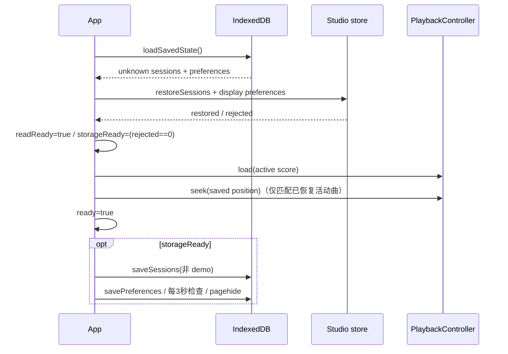

# 应用、状态与本机保存

Purpose: 说明 App 的组合职责、状态变迁、缓存引用、IndexedDB 格式和浏览器交互。
Authority: 当前实现手册；不承诺审计中尚未实现的容错、同步或镜头保存能力。
Update when: store actions、保存格式、初始化顺序或 UI 生命周期改变。
Last verified: 2026-10-06；核对第1步保存恢复修复，其余行为沿用 `e15cad5` 审阅。

## 入口和职责

[main.tsx](../../src/main.tsx) 在 StrictMode 下挂载 [App](../../src/ui/App.tsx)，加载普通和水墨两套 CSS。[store.ts](../../src/state/store.ts) 导出模块级 `useStudio = createStudioStore()`；创建时以 seed=107 编译 Quick Study，建立 `score-0`。App 构造一组 PlaybackClock、ToneAudioEngine、PlaybackController，并将音频 clock 快照传给 Scene。

App 当前同时承载初始化、导入、曲库、播放、持久化、快捷键、全屏、主题和镜头偏好，仍是建议拆分的首要文件；第1步只修复恢复接线。职责和更新问题见审计 A11。

## Zustand 缓存和动作

`ScoreSession = {id, filename, seed, compiled}`。编译结果只保存在内存；IndexedDB 保存的是 score/seed，重开时重新编译。顶层 `compiled/seed` 镜像当前 session，select/remove/regenerate 必须保持它们一致。

| Action | 当前状态变化 | 编译 / 时间 / 声音 |
| --- | --- | --- |
| `addScores(entries)` / `setScore(score)` | 加到库中，选中本批第一首；单调生成 score-N ID | 新曲编译；store 自身不控制播放，App 在导入成功前 stop |
| `restoreSessions(records: unknown,activeId)` | 加回 demo，校验并逐条编译，拒绝非法/失败/重复 ID，选活动曲或 demo；返回 `{restored,rejected}` | 启动时执行，不恢复 playing；App 据 rejected 控制自动写入 |
| `selectSession(id)` | 选择已缓存 session，复用 compiled 引用 | 不重新编译；App 的 score 依赖触发音频 load |
| `removeSession(id)` | 删除并选择相邻/保留当前；最后一项时回 demo | App 删除活动曲前 stop；不删除磁盘 MIDI 文件 |
| `regenerate()` | seed+1，当前 session 和镜像换新 compiled | score 本身保留引用；生成新 world/plan，不表示新音频文件 |
| `setPreset / setViewMode / setVisibilityMode` | 只替换展示字段 | 保持 compiled/world/plan 严格引用 |
| `setStreamStyleId / setInkMode` | 相同值不再次 set；只改展示偏好 | 不重载音频、不重置播放 |

store 不保存 DOM、Synth、GPU 对象或时钟。UI 的停止动作与 store action 需要配对使用；直接在工具中调用 selectSession 不会自动执行 `stopForSwitch`。

## 初始化、保存和错误状态流

读取失败会标记存储不可用，`finally` 仍设 readReady，允许只在内存使用；注意未结束的 IDB Promise 进不了 finally。load 首次失败的 ready/错误 UI 缺口也尚未修复，见 A06/A08。

恢复时位置超出曲尾回到 0，否则 seek 到该处并保持暂停；不会自动解锁发声。只有已恢复活动曲与保存 activeSessionId 匹配才应用 position，回退 demo 不应用失败曲目的时间。

`currentPreferences` 从 clock 读取最新歌曲秒数；每 3 秒检查与上次保存位置差是否 ≥1 秒，页面 pagehide 另触发保存。偏好变更也会通过 effect 保存；异步 pagehide 不保证页面结束前完成。任一保存曲目拒绝恢复时，本次会话暂停所有曲库/偏好写入，保留原数据库；正常曲目及临时导入仍可使用。曲库中持续提示临时状态，提供刷新重试和 MIDI 导入入口。事务失败仍走原 storageFailed 提示，不等同于已解决 A06。

## 保存协议

[persistence.ts](../../src/state/persistence.ts)：database=`harmonic-motion`，version=1，object store=`saved-state`。

| Key | 值 |
| --- | --- |
| `sessions` | SavedSession[]：id、filename、seed、score；不存 demo、不存 compiled/GPU/音频 |
| `preferences` | version:1、activeSessionId、position、viewMode、visibilityMode、effectsEnabled、volume、muted、followViews、可选 melodyTracks/streamStyleId/inkMode |

`normalizeStreamStyle(unknown)` 回退 original，`normalizeInkMode(unknown)` 回退 drops，兼容旧偏好。melodyTracks 在 App 恢复时再与实际曲库/轨道核对。真实相机坐标/缩放、通用 preset registry、播放中状态均不保存。

[sessionValidation.ts](../../src/state/sessionValidation.ts) 的 `isSavedSession(unknown)` 在编译前核对 session 标识/seed、score 元数据、有限 note end、排序、唯一 ID、音符范围，以及全局/轨道/和弦副本的一致性；复用 detectChords 的当前分组规则。历史记录未带 version 或 version=1 可恢复，未知版本拒绝。loadSavedState 不过滤原值，只有缺失 sessions 键才返回空数组。没有迁移版本表、整库导出或跨窗口协调；A06/A07 仍待修复，不应通过改 TypeScript interface 就认为完成格式升级。

origin（协议+主机+端口）和浏览器 profile 共同决定存储范围。5173 开发、4173 preview、5174 launcher 不共享同一 origin；127.0.0.1 与 localhost 也不同。独立窗口的专用 profile 与日常浏览器分开。用户曲库“消失”首先核对这些信息，不要清库。

## 导入与交互

`onLoad` 顺序读取各 File、限制大小、调用 parseMidi；每个解析失败记录文件名和原因，成功项批量交给 addScores；importRevision 防止过时导入覆盖较新的意图。编译失败会在外层显示错误；当前 addScores 的 map 是一批全编译后才 set，不能声称任意编译错误下也有逐条事务提交。

`switchScore/deleteScore/stopForSwitch` 维护活动曲与播放的一致性。`togglePlayback/seekBy/replayRecent/toggleMute/toggleFullscreen` 为 UI 动作入口；键盘忽略输入控件、修饰键、文本组合与重复按键，避免抢占编辑。

| UI / 配置文件 | 责任 |
| --- | --- |
| `App.tsx` / `StreamStyleButtons` | 设置面板、导入、曲库、transport、Original/水墨按钮、错误提示 |
| [Icons.tsx](../../src/ui/Icons.tsx) | 固定 union 名称到 SVG 图标；不含播放器状态 |
| [styles.css](../../src/ui/styles.css) | 原版布局、控件、响应式和舞台容器 |
| [ink.css](../../src/ui/ink.css) | 水墨册页、纸面、文字/印章/布局与对应控制样式 |
| [branding/config.ts](../../src/branding/config.ts) | 名称、描述、引语及候选名；品牌不是音乐算法配置 |

选择水墨会将 View 设为 stream；切往其他 View 仍保留 StreamStyle 偏好，effectivePreset 只在 Stream 生效。Ink 不暴露 3D zoom/pan，不能把隐藏相机当作纸面相机。

## 测试与扩展约束

[session.test.ts](../../tests/session.test.ts) 验证 store 动作、非法/部分恢复和引用；[persistence.test.ts](../../tests/persistence.test.ts) 用 IDB mock 验证原值读取及正常保存，不覆盖 abort/blocked。[ink-stream.test.ts](../../tests/ink-stream.test.ts) 覆盖风格/投影；[playback.test.ts](../../tests/playback.test.ts) 覆盖动作时间契约。它们不是 React App + 真实 IndexedDB 的自动集成测试；第1步另外做了 [隔离浏览器验证](../VERIFICATION.md#audit-step-1-2026-10-06)。

新增保存字段要定义缺省、未知值回退、旧数据和迁移；新增 UI 动作先明确所有者，不复制一份 clock 或 compiled；拆 App 前补 restore/load/save/dispose 的次数与顺序验证，特别覆盖 StrictMode 的 effect 清理/重建。不要为了拆文件顺手重设计曲库和产品操作。
