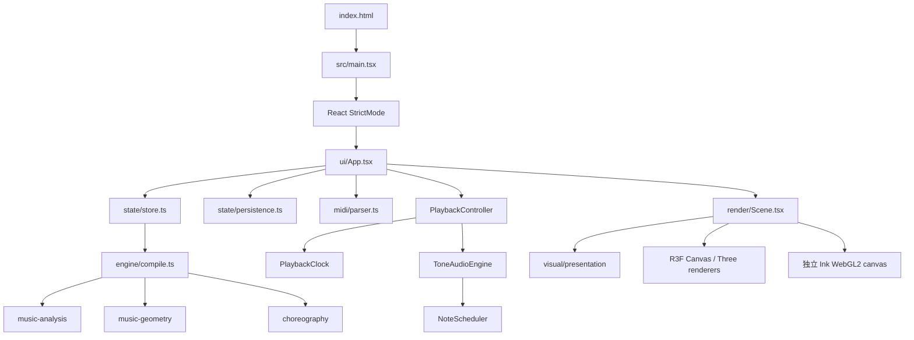
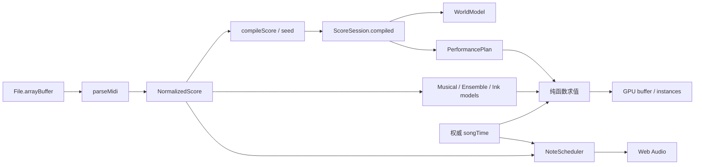

# Developer Handbook

Purpose: 提供从应用入口到音乐核心、状态和绘制的开发阅读路径。
Authority: 当前实现的开发说明；稳定契约以 ARCHITECTURE 为准，ownership 以 CODEBASE_OPERATING_MODEL 为准。
Update when: 入口、模块依赖、状态所有权或本手册目录变化。
Last verified: 2026-10-05；源码基线 `e15cad5`，不包含审计问题的源码修复。

## 从哪里开始

1. 先读 [用户 README](../../README.md)，实际理解导入、播放和舞台选择。
2. 按 [配置与启动](setup-and-configuration.md) 启动；再看下方架构和对应模块手册。
3. 开发前走 [AGENTS](../../AGENTS.md) → [知识索引](../index.md) → [影响矩阵](../CHANGE_IMPACT_MATRIX.md)。
4. 排查故障看 [FAQ 与错误](troubleshooting.md)；新功能看 [扩展与维护](extending-and-maintaining.md)；重构先看 [全仓审计](../../CODEBASE_AUDIT.md)。

| 手册 | 包含模块 |
| --- | --- |
| [音乐流水线](music-pipeline.md) | domain、midi、analysis、geometry、compile、choreography、demo、utils |
| [播放与音频](playback-audio.md) | PlaybackClock、PlaybackController、AudioEngine、ToneAudioEngine、NoteScheduler |
| [应用与状态](application-state.md) | main、App、Zustand store、IndexedDB、UI、branding |
| [视觉与渲染](visual-rendering.md) | theme/effects/environment/preset、三种 presentation、所有 renderer、camera、shader |
| [配置与启动](setup-and-configuration.md) | 安装、端口、Windows launcher、依赖、测试、构建、参数和诊断 |
| [FAQ 与错误](troubleshooting.md) | 用户故障定位、开发误区、恢复边界 |
| [扩展与维护](extending-and-maintaining.md) | 规范、测试、增量扩展步骤、文档维护 |

## 应用入口与运行结构

这是本机运行的 React/TypeScript 单页应用，没有业务后端、用户账户、云库或远程音乐 API。Vite 提供开发服务；生产构建是 `dist/` 静态资源。

箭头表示实际调用/运行依赖的概览，不是逐个 import 图；公共数据类型来自 domain。Audio 对 Clock 的依赖是共享时间源，不是另建时钟。

`main.tsx` 载入 `styles.css` 和 `ink.css`，挂载 App。`useStudio` 是模块级 store，导入时就编译原创 Quick Study。另一个入口 `benchmarks.html → tests/browser/benchmark.tsx` 用于开发诊断；它不是第二个正式产品入口，当前 Ink/存储限制见审计 A10。

## 模块依赖规则与当前例外

| 模块 | 可以依赖 / 当前依赖 | 不应负责 |
| --- | --- | --- |
| domain | 基础数据类型；visual 使用 Vec3/WorldBounds 类型 | React、Three 对象、Web Audio、I/O |
| midi | @tonejs/midi、domain、utils、chord grouping | 视觉、播放、状态和 GPU |
| music-analysis | score/domain、纯函数 | 真实旋律识别的未经验证声明 |
| music-geometry | score/analysis、strategy 接口、utils | 颜色、材质、相机、声音 |
| choreography | world/score/performance、utils | 碰撞发声、逐帧物理模拟 |
| playback | clock、AudioEngine 接口；clock 仅注入 now | 视觉、DOM、Tone Transport |
| audio | score、clock、Tone、scheduler | 按画面显示预算删除音乐数据 |
| visual | domain、utils；纯展示预计算和绝对时间求值 | 改写 score/world/plan，加载音频 |
| render | Three/R3F/React、visual、编舞 evaluator | 文件解析、持久化、改变权威时间 |
| state | Zustand、compile/demo、配置、存储数据类型 | 保存 GPU/音频实例 |
| UI | 组合以上能力、浏览器交互 | 新建另一个音乐时钟 |

当前 `persistence` 为兼容偏好值直接调用 visual/presets 的纯 normalize 函数；store 又从 persistence 导入 `SavedSession` 类型。这是窄的组合依赖，不是运行时循环。若保存格式复杂化再提取存储契约，不提前建立多层服务。对当前 56 个源码 TS/TSX 的 import 图检查未发现运行时循环；具体方法见审计。

## 数据流：静态产物与动态求值

World 是正式音乐空间，Plan 是正式抵达/事件计划；Stream、Ensemble、Ink 是只读 score 的不同展示投影。View 变化不改变 CompiledScore。seek 只改变时间后重新求值，不调用编译器。主题和显示预算只影响看见什么，不改变输入乐谱。

## 状态流与唯一所有者

| 状态 | 所有者 | 读者 / 生命周期 |
| --- | --- | --- |
| 导入曲库、activeSessionId、compiled、seed | Zustand store | 切曲取缓存；重生成才更换 world/plan |
| View、visibility、StreamStyle、InkMode、基础 preset | Zustand store | UI/Scene；偏好子集保存到 DB |
| 播放状态、歌曲秒数、source anchor | PlaybackClock | controller/audio；由同一 now 推导 |
| 每帧绘制时间快照 | App 的 `snapshot` ref | 所有 renderer；是 Clock 的副本，不自行计时 |
| transport 显示时间 | App 的低频 React state | 约每 >32ms 刷新；不是权威时间 |
| 音量/静音、followViews、melodyTracks、面板/全屏/错误 | App | 音量同步给音频；部分偏好持久化 |
| Synth、声部占用、调度游标、timer | ToneAudioEngine / NoteScheduler | pause/seek/dispose 清理或重建 |
| 实际相机位置、OrbitControls target | CameraRig / Three | fit、平移、缩放、跟随；不存进 WorldModel |
| 曲库副本和偏好 | 当前 origin/profile 的 IndexedDB | 启动恢复为暂停；不是实时内存状态的替代品 |
| Mesh、buffer、shader、WebGL context | 对应 renderer | 挂载准备、帧内更新、卸载释放 |

当前没有“保存任意镜头姿态”的功能；follow 开关被保存，Three 相机的实际坐标/缩放不在 SavedPreferences 中。不要根据 UI 拥有镜头就假定它能跨启动恢复。

## 文件地图与变更原则

核心函数逐项见上述手册和 [CODEBASE_OPERATING_MODEL](../CODEBASE_OPERATING_MODEL.md)。测试覆盖入口见 [TEST_MATRIX](../TEST_MATRIX.md)，本次新增发现见 [审计](../../CODEBASE_AUDIT.md)。已有 `/docs/plans` 保存一次性实施计划，`/docs/decisions` 保存跨层决策，不把历史完成记录当作当前源码规范。

本轮不改音乐算法、绘制代码、依赖或测试。下一轮先为明确缺陷补复现测试，再做最小修复；“文档描述了风险”不意味着已获准实现所有建议。
