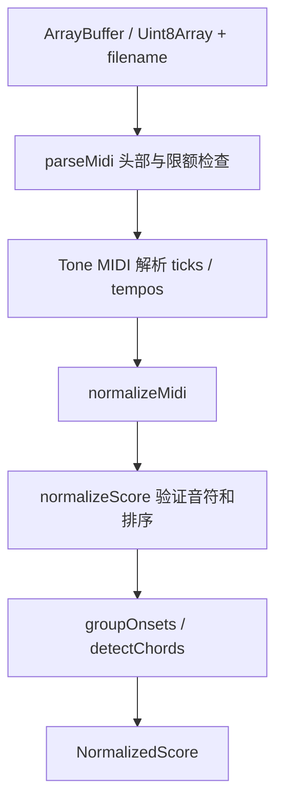

# 音乐数据与编译流水线

Purpose: 说明音乐核心输入输出、关键符号、算法边界和验证要求。
Authority: 当前实现细节；音乐契约与不变量以 ARCHITECTURE 为准。
Update when: 数据模型、解析、分析、几何、编舞或纯工具契约变化。
Last verified: 2026-10-05；源码基线 `e15cad5`。

## 数据模型

| 文件 / 类型 | 核心字段与语义 |
| --- | --- |
| [domain/score.ts](../../src/domain/score.ts) `NoteEvent` | id、startTime/duration（秒）、midi/pitchClass/octave、velocity 0–1、trackId/channel/instrument |
| 同文件 `TrackModel` / `ChordEvent` | Track 按 MIDI 轨道保存 notes；Chord 是同一起音音符组，不是大小调和弦名称识别 |
| 同文件 `NormalizedScore` | duration、可选 bpm、notes/chords/tracks、metadata（title/source/tempoMap）；notes 全局按起音排序 |
| [domain/analysis.ts](../../src/domain/analysis.ts) `MusicAnalysis` | pitchRange、noteDensity、chords、相邻音程 intervals、trackGroups；不包含情绪或真正乐句识别 |
| [domain/world.ts](../../src/domain/world.ts) `WorldModel` | nodes、connections、layers、bounds、metadata；坐标是普通 Vec3，不是 Three.Vector3 |
| 同文件 `MusicNode` | id/kind、position、time/duration、noteIds/layerIds/strength；kind 支持 note/chord/anchor/rest，当前策略主要生成 note/chord |
| [domain/performance.ts](../../src/domain/performance.ts) `PerformancePlan` | duration、performers、events；轨迹是可序列化 cubic Bézier 定义，不保存运行实例 |
| 同文件 `PerformerPlan` / `TrajectorySegment` | 起始位置、按时序抵达目标、分段时间和曲线；由绝对歌曲时间随机访问 |

这些接口没有运行时自动校验，也不是 readonly 深冻结对象。核心按只读输入约定使用，测试检查确定性与不变性；保存数据恢复当前校验不足，见审计 A01。扩展时不能把“类型可编译”等同于“外部数据合法”。

## 从 MIDI 到 NormalizedScore



| 符号 / 文件 | 输入 → 输出；边界 |
| --- | --- |
| [parseMidi](../../src/midi/parser.ts) | bytes + 可选文件名 → score；10 MiB、20,000 notes；检查 MThd、拒绝 Type 2 / SMPTE / 空乐谱；抛可显示错误 |
| [normalizeMidi](../../src/midi/normalize.ts) | 已解析 Midi → ScoreInput → score；共享 tempo map 把 ticks 换为秒；只提取音符、轨道/channel/instrument 和 tempo |
| `normalizeScore` | ScoreInput → 有序 score；验证有限 time/duration/midi/velocity、非负起音、正时长、整数 MIDI 0–127；velocity clamp；生成稳定 track/note IDs 和总体 duration |
| `decodeMidiTitle`（内部） | 先尝试与文件名一致的 UTF-8/GB18030/Big5/Shift_JIS 解码，再采用可信 UTF-8 或回退；不是任意 MIDI 编码自动识别 |
| [groupOnsets](../../src/engine/music-analysis/chords.ts) | 已排序 notes → onset groups；epsilon=1e-7 秒；不按拍点量化 |
| `detectChords` | 多成员 onset group → ChordEvent；保留成员音符，不做调性/和弦标签分析 |

排序和稳定 ID 是二分查询、seek 和 seeded 展示的前提。直接构造 `NormalizedScore` 时必须自行遵守全部契约；推荐测试/示例走 `normalizeScore`。目前 channel/instrument、tempo 元数据和最终时长溢出未完整校验，不能用于接收未经校验的外部 JSON。

示例（位于仓库根的测试文件可按实际相对路径导入）：

```ts
import { normalizeScore } from '../src/midi/normalize'

const score = normalizeScore({
  metadata: { title: 'One note', source: 'demo' },
  tracks: [{ name: 'Piano', channel: 0, instrument: 0,
    notes: [{ time: 0, duration: 1, midi: 60, velocity: 0.8 }] }],
})
```

该代码是构造输入示例，不是新增产品入口；单音不会因没有相邻节点而需要虚构第二个目标。

## 编译、几何与分析

[compileScore](../../src/engine/compile.ts) 接收 `(score, strategy, seed)`，返回 `{score, analysis, world, plan}`。score 保留原引用；它不启动播放、不修改相机、不载入声音。

1. [generateWorld](../../src/engine/music-geometry/generator.ts) 调 [analyzeScore](../../src/engine/music-analysis/analyzer.ts)，形成 GeometryContext。
2. [GeometryStrategy](../../src/engine/music-geometry/GeometryStrategy.ts) 的 `generate(score, context)` 产生 WorldModel。
3. [planPerformance](../../src/engine/choreography/planner.ts) 用 world + score 生成演奏计划。

[ConstellationGeometryStrategy](../../src/engine/music-geometry/strategies/constellation.ts) 是当前唯一正式几何策略：

- 每个 onset group 一个可抵达节点；同刻跨轨音符合并为 chord 节点，layerIds 保留归属。
- 音高范围、相邻音程、时间间隔、轨道层次影响步进与位置；seed 控制方向扰动；坐标不是简单的时间轴。
- 连续 sequence 和轨道 voice 边表达不同关系；strength 来自力度；bounds 用于取景。
- 不含颜色、材质、粒子、镜头和音频逻辑。Stream/Ensemble/Ink 都不是该策略的分支。

新增策略仍由组合层显式注入，不能到 renderer 中到处检查 strategy ID。当前 store 暴露 strategy 状态，但没有用户可切换 strategy 的动作/UI。

## 编舞、事件与随机访问

| 文件 / 符号 | 作用与前提 |
| --- | --- |
| [planner.ts](../../src/engine/choreography/planner.ts) `planPerformance` | 按音乐节点 time 排序，创建单 Performer 的 cubic segments 与事件；相邻目标时间必须严格增加，同时间两个独立目标会抛错 |
| [trajectory.ts](../../src/engine/choreography/trajectory.ts) `evaluateTrajectory` | cubic 参数 u → Vec3；端点精确返回，内部插值 |
| 同文件 `evaluateSegment` | songTime → 归一化段进度 → 位置；clamp 到端点 |
| [evaluator.ts](../../src/engine/choreography/evaluator.ts) `evaluatePerformer` | 二分查段；首音前停首位置，末段后停末位置；无需模拟此前帧 |
| 同文件 `evaluateNode` | node + time → upcoming / active / past |
| 同文件 `eventsInWindow` | 返回当前时间之前、给定 lifetime 内的计划事件，供展示效果消费 |

核心公式：`u = clamp((t - startTime) / (endTime - startTime), 0, 1)`。音乐规定到达时间，路径服务于这个约束。当前没有保证段间速度/加速度连续，也没有多 Performer 分裂/合并；需要这些语义时先提出明确契约和 ADR，不能在 renderer 中偷偷改抵达时间。

## demo、工具与测试

- [demo/score.ts](../../src/demo/score.ts)：`createQuickStudyScore` 是默认约 31 秒原创示例；`createDemoScore` 是仍被测试使用的较早示例，不因 UI 不用它就判为死代码。
- [utils/math.ts](../../src/utils/math.ts)：`clamp`、`lerp`、`mixVec`；`seededRandom(seed)` 返回 Mulberry32 随机函数；`upperBound(items,time,key)` 返回首个 key > time 的索引，要求输入有序。不要在纯核心用 Math.random、Date.now 或帧累计结果。
- [midi.test.ts](../../tests/midi.test.ts)：格式/tempo/编码/限额；[engine.test.ts](../../tests/engine.test.ts)：确定性、几何与编舞不变量；[quick-study.test.ts](../../tests/quick-study.test.ts)：示例曲结构；[performance.test.ts](../../tests/performance.test.ts)：合成规模检查。

定向验证：`npm run test -- tests/midi.test.ts tests/engine.test.ts tests/quick-study.test.ts`。核心变化还要全量 test/lint/build；显示变化不能通过改核心测试预期来掩盖模型被重建。

## 已知边界与扩展入口

解析不还原踏板/弯音/表达控制器，和弦只按同步起音分组；无真实旋律/调性识别。超长稀疏曲的内存风险来自展示预计算，而非几何需要按秒数组；详见审计 A02。新输入格式应先适配 score；新正式空间实现 GeometryStrategy；新美术舞台去 visual/render。具体步骤见 [扩展指南](extending-and-maintaining.md)。
