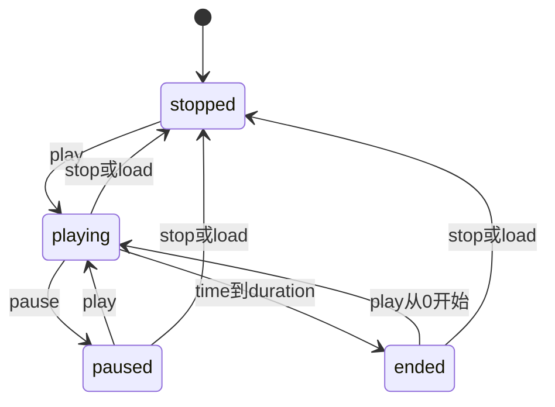
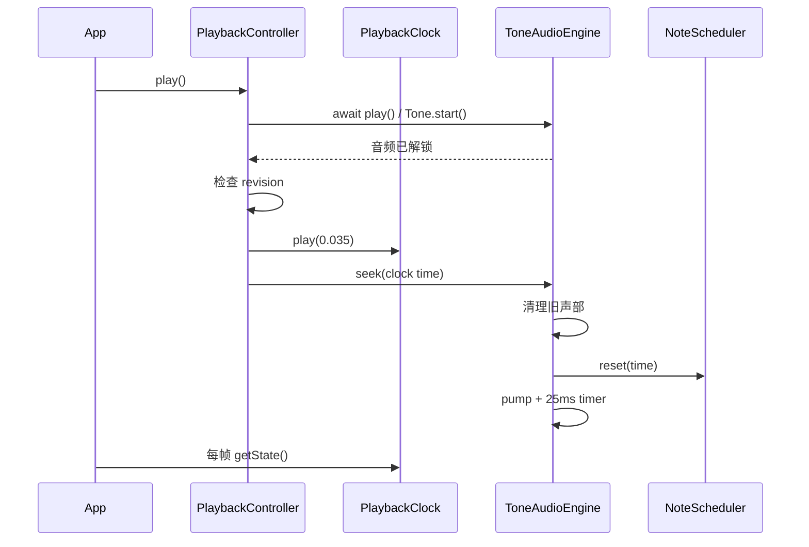

# 播放时钟与音频

Purpose: 说明单一时钟、播放动作、异步竞争、音符调度和声音资源生命周期。
Authority: 当前播放/音频实现手册；单一时间契约以 ARCHITECTURE 为准。
Update when: 时间映射、控制器接口、调度策略、音频配置或清理行为改变。
Last verified: 2026-10-05；源码基线 `e15cad5`。

## 唯一权威时间

[PlaybackClock](../../src/playback/clock.ts) 构造参数是 duration 与注入的 `now(): number`。浏览器注入 [audioNow](../../src/audio/ToneAudioEngine.ts)，即 `Tone.immediate()`；测试注入人工单调时间。它不依赖 React、R3F elapsed time 或 Tone.Transport。

```text
songTime = savedPosition + max(0, sourceNow - sourceAnchor)
scheduledSourceTime = sourceAnchor + noteSongTime - savedPosition
```

位置是歌曲秒数，source time 是同一个 AudioContext 的绝对秒数，不能混用 performance.now 的毫秒。App 的 rAF 只复制 `clock.getState()` 到 ref；renderers 只读这个快照。UI 时间标签略低频更新不改变音乐时间。



seek 的补充规则：playing 时 seek 到曲内仍 playing；停止/暂停时 seek 到曲内成为 paused；seek 到末尾为 ended；非有限时间抛错；范围 clamp 到 `[0,duration]`。零时长不启动。

## 关键类与方法

| 类 / 方法 | 行为 |
| --- | --- |
| `PlaybackClock.getCurrentTime/getState` | 求当前时间；到末尾时更新 ended，不需专门结束 timer |
| `play(leadTime=0)` | 建 source anchor；从末尾播放会归零；控制器传 0.035 秒 |
| `pause/stop/restart/seek/setDuration` | 分别冻结、归零、从头启动、随机跳转、换时长并停止；Clock 自身不操作声音 |
| `sourceTimeFor(songTime)` | 把音乐事件时刻映射到同一 now 的 source time；只应在播放映射有效时调度 |
| [PlaybackController](../../src/playback/controller.ts) `load/play/pause/stop/restart/seek/dispose` | 协调 clock 和 AudioEngine；revision 防止过期异步解锁开始播放 |
| [AudioEngine](../../src/audio/AudioEngine.ts) | load/play 为 Promise，pause/stop/seek/dispose 为同步接口；是控制器依赖的边界 |
| [NoteScheduler](../../src/audio/scheduler.ts) `reset/takeUntil` | 维护有序音符游标和 seek 后仍持续的 held notes；不是时钟 |
| [ToneAudioEngine](../../src/audio/ToneAudioEngine.ts) | 解锁、预调度、独立 Synth 声部、音量、limiter 和清理；`setVolume/setMuted` 是具体适配器扩展方法，暂不在 AudioEngine 接口中 |

## Play 的时序



若解锁等待期间 pause/load/seek，revision 改变，旧 play 返回后不再启动时钟。此保护不等于所有错误都已回滚：seek/pump 抛错后可能残留 playing 状态，见审计 A08。新增异步适配器必须测试 load 顺序、取消和 dispose，不能只依赖 App 的 effect active 标志。

## 音符调度与资源

`NoteScheduler.reset(t)` 二分找到之后的游标，同时找出 `startTime <= t < endTime` 的持续音，以 `startTime=t`、剩余 duration 重新发声。`takeUntil(horizon,currentTime)` 消费 held 和未来窗口，错过且已结束的音符不补播；仍持续的音符从 currentTime 播剩余部分。

Tone 每 25ms 向前调度 0.2 秒。Web Audio timestamp 是 `max(Tone.immediate(), clock.sourceTimeFor(event.startTime))`，主线程轮询不是发声时钟。每个重叠同音可以用独立 Synth，不按 MIDI pitch 统一 note-off。

| 配置 | 当前值 / 位置 |
| --- | --- |
| 预调度 | `AUDIO.horizon=0.2` 秒，`intervalMs=25` |
| 声部预算 | `maxPolyphony=64`，含 release 占用；无空闲声部跳过新音，不删除 score |
| 音色 | custom partials `[1,0.56,0.25,0.12,0.05]`；attack 0.004、decay 1.3、sustain 0.12、release 0.3 |
| 音量 | 每 Synth -18dB；master 默认 0.8，变化用 0.03 秒 ramp；limiter -1dB |

pause 会清 interval、dispose Synth 和 limiter；保留 master gain 供后续使用。seek 先 pause，再 reset；仅 clock 是 playing 时建立输出并 pump。dispose 还释放 master。音色是键盘式合成音，不是采样钢琴或 General MIDI 乐器库。

## 切歌、seek 和换肤的边界

- **切歌**：App stop → store 选择缓存 score → score 依赖的 load effect。新曲归零；原 compiled 保存在 session。
- **seek**：clock.seek → audio.seek → renderer 下帧按新绝对时间重建；不编译 world/plan。
- **视图/风格**：仅 state/preset/presentation 更新；同 score 引用使 load effect 不触发。不能通过重新挂载 App “清理主题”。
- **暂停**：声音停止、snapshot 时间固定；3D Canvas 当前仍会绘帧，Ink 在时间/配置未变时跳过绘制。这是渲染效率问题，不是音乐时钟继续推进。
- **静音**：master gain 变 0，clock 继续，恢复声音后仍在当前歌曲位置。

浏览器 AudioContext 被挂起时，now 也冻结；主线程后台调度可能丢过期短音。seek 只恢复剩余时值，不恢复精确振荡器相位或已走过的 ADSR。

## 测试与故障排查

定向命令：`npm run test -- tests/playback.test.ts tests/audio.test.ts`。前者检查人工时钟、随机 seek 和异步控制；后者使用 Tone mock 检查调度、重叠同音、释放、音量和 dispose。它们不证明真实声卡音质或所有浏览器自动播放策略。

新增行为至少覆盖：unlock 未完成时 pause/load/dispose、seek 在长音内部、尾部 ended、同音重叠、超预算声部、失败后的状态与清理、同分数换肤不重复 load。真实无声先查浏览器解锁/静音/音量/输出设备，再查 scheduler 和 source time，见 [FAQ](troubleshooting.md)。
