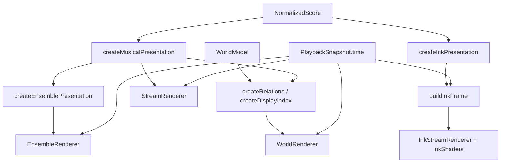

# 展示、渲染与相机

Purpose: 说明三种舞台的纯展示模型、配置边界、逐帧绘制和资源所有权。
Authority: 当前视觉实现手册；不替代音乐核心契约或美术验收。
Update when: presentation、renderer、shader、camera、preset 或显示预算变化。
Last verified: 2026-10-06；核对稀疏 energy 和按需准备，其余渲染说明沿用 `e15cad5` 审阅。

## 四种画面，三个 View

`ViewMode` 只有 constellation / stream / ensemble。水墨册页是 Stream 的 style，内部有 drops（宣纸落墨）与 veins（墨脉）；不是第四种 GeometryStrategy，也不重建世界。

所有坐标/生命周期从 score/config/songTime 计算。display thinning 可以不画某些音符，audio 仍读完整 score。不要用动画播放了多少帧决定墨迹、粒子或轨迹状态。

## 配置和 preset

[domain/visual.ts](../../src/domain/visual.ts) 是纯数据契约，文件里不应出现 Three material 或 React component。

| 类型 / 默认文件 | 控制内容 | 实际边界 |
| --- | --- | --- |
| `VisualTheme` / [defaultCosmic](../../src/visual/themes/defaultCosmic.ts) | palette、nodeStyle、performerStyle、lighting | 部分字段无当前消费者；BasicMaterial 不响应灯光；见审计 A13 与 D-01 |
| `EffectProfile` / [defaultEffects](../../src/visual/effects/defaultEffects.ts) | hit、trail、particles 的 enabled/寿命/尺寸/数量 | 不同 renderer 只使用适用项；关闭不停止核心音符运动 |
| `EnvironmentConfig` / [defaultEnvironment](../../src/visual/environments/defaultEnvironment.ts) | solid / gradient+seeded stars / image+fallback color | Scene CSS 负责底色/图片；EnvironmentRenderer 负责渐变星点；image 不意味着已经实现加载重试服务 |
| `CameraConfig` / [staticCamera](../../src/visual/camera/staticCamera.ts) | fov、padding、direction、距离范围 | 只影响观看；Ink 是二维纸面，不消费 3D 镜头操作 |
| `PresentationConfig` / [defaultPresentation](../../src/visual/presentation/defaultPresentation.ts) | salience、relations、visibility、stream 路径/窗口 | 启发式不是经标注验证的音乐分析 |
| `VisualPreset` / [defaultPreset](../../src/visual/presets/defaultPreset.ts) | 组合上述配置，附可选 streamStyle/inkMode | 切换不改变 compiled |

[resolveStreamPreset](../../src/visual/presets/inkStream.ts) 在 stream+ink 时从 base 创建浅组合，替换 id/name/style/mode/environment；camera/presentation/effects/theme 引用保留。其他 View 直接返回 base。当前 UI 不是通用 preset 编辑器；Original/水墨入口驱动外围 CSS 与实际 renderer。不要以 D-01 未完全配置化为由重写音乐层。

## 通用音乐展示与 Constellation

| 文件 / 关键函数 | 输入输出与用途 |
| --- | --- |
| [musicalPresentation.ts](../../src/visual/presentation/musicalPresentation.ts) `selectSalientNotes` | score + weights + 可选 trackId → 展示主线音符；0.22 秒窗口内综合力度/时值/音区/连续性，ID 稳定打破平局 |
| 同文件 `createMusicalPresentation` | 准备 lead、notes、positions、phrases、leadIds、noteBlocks、phraseByNote、supportPaths；不改原 score |
| `evaluateLead` | 在 lead 相邻点间按 songTime 插值；Stream 主角和相机目标使用它 |
| `noteLifecycle` | upcoming/hit/active/fade 等展示参数；hit 含视觉预示，不代表音频提前起音 |
| `notesInWindow / visibleStreamNotes / visiblePhrases` | 时间候选、120 音符预算和已准备短组的查询；保留跨窗口持续音 |
| `curveBetween` | 两点之间的确定性采样曲线；显示用，非正式编舞轨迹 |
| [relations.ts](../../src/visual/presentation/relations.ts) `createRelations/selectRelations` | World + score + display model → lead/voice/chord/sequence 关系及邻接；预算选择时保留更重要关系 |
| [evaluatePresentation.ts](../../src/visual/presentation/evaluatePresentation.ts) `evaluateNodePresentation` | 依据绝对时间、visibility 配置求 emphasis/scale 等；`selectReadableNodeIds` 当前仅旧测试使用 |
| [renderBudget.ts](../../src/visual/presentation/renderBudget.ts) `createDisplayIndex/nearestNodes/selectDisplayNodes/complexityPolicy` | 预建时间/空间显示索引；以镜头 detail 与预算选出绘制节点；不从 WorldModel 删除节点 |

默认重要参数：Focus 96、Path 36；Overview 220–640 随 detail；relations maxEdges=180、samples=12；chordMembers=160、ghostPoints=96；Stream maxVisibleNotes=120、leadIn=4.5s、hitDuration=0.34s、fadeOut=1.8s。正式数值以配置为准，调整时更新此表和对应回归。

## Ensemble / Radial Stage

[ensemblePresentation.ts](../../src/visual/presentation/ensemblePresentation.ts) 在 score + MusicalPresentation 上建立稳定轨道扇区、pitch placement、候选 representatives、chordByNote、energy 和 bounds。超过 12 条轨道会复用角区并加层次，不是推断的真实复调声部。

- `visibleEnsembleNotes`：0.18 秒局部组保留代表音/音高极值，时窗筛选和同声部空间去重后按轨道轮询，最多 96 音符。
- `ensembleNoteState / ensemblePoint`：hidden → emerging（起音前 3.5 到 1.65 秒）→ approaching → active → fading（结束后 1.2 秒）。内外半径、弧度、深度、scale、opacity 和 glow 都是绝对时间函数。
- `ensemblePath`：内层至当前点的采样轨迹；当前淡出 progress 重用缺陷见审计 A05。
- `ensembleMotion`：按音符 energy 派生克制平移/旋转/倾斜/缩放；reducedMotion 时返回静止姿态。energy 使用 `Map<number,number>`，只储存有起音的秒桶；峰值归一化与相邻秒平滑插值保持，空秒默认 0。A02 已修复，内存不随静默时长增长。

其主体是音符及其关系，没有判定圈/命中输入/计分。增加运动应先说明它表达何种音乐结构，不应使整圆盘运动压过音符。

## 水墨展示与 GPU 协议

[inkPresentation.ts](../../src/visual/presentation/inkPresentation.ts) 的 `createInkPresentation(score,config,focusTrackId?)` 准备主辅声部区域、同音聚合 anchor、连笔 next/branch 和 32 音符块索引。`buildInkFrame(model,mode,time,width,height,effects)` 返回当帧 InkMark[]，无历史 canvas 累加。

窗口/历史参数均为 14 秒，纸面 origin=`max(0,time-9)`；显示候选上限 160，mark 上限 6000。drops 用墨点表达起音与余韵；veins 按音符时值连续采样笔触，含主线、伴随、枝接和和弦淡墨。预算选择不改变发声音符。重复短同音 anchor 缺陷见 A03。

[InkStreamRenderer](../../src/render/InkStreamRenderer.tsx) 拥有独立 WebGL2 context，而非 R3F mesh。它准备 shader/program/VAO、静态四边形和实例 buffer；ResizeObserver 标记尺寸变化，DPR 最大 1.75。rAF 读共享 snapshot；时间、配置和尺寸没变时跳过绘制，document.hidden 时不绘制。

每个 mark 使用 12 个 float / 48 字节：

| attribute | 四个分量 | byte offset |
| --- | --- | --- |
| `aStamp` | x, y, radius, born | 0 |
| `aStyle` | seed, strength, aspect, angle | 16 |
| `aLife` | duration, type, dry, memory | 32 |

type 目前约定 0=drop、1=brush、2=wash；source 仅保留在 CPU 数据里供来源/测试使用，不上传 GPU。[inkShaders.ts](../../src/render/inkShaders.ts) 负责纸纹、湿边、墨心、干湿余迹等程序化表现，混合方程使用 `gl.MAX`。这不是流体求解器或物理吸墨模拟。

初始化失败显示重试/切回原版提示；contextlost 暂停帧，contextrestored 重建；清理注销事件、observer、rAF、buffer、shader、program、VAO。后续帧异常不自动被初始化 try/catch 捕获，扩展计算时要考虑故障路径。更改 CPU packing 必须同步 shader，不能只改一侧。

## Renderer 与资源归属

| 文件 / 组件 | 责任 |
| --- | --- |
| [Scene](../../src/render/Scene.tsx) | useMemo 准备通用 musical 模型，按 ensemble View / Ink 生效分别准备对应模型；组合 background、CameraRig 和 View 分支；SceneBoundary 仍仅包 Canvas |
| [WorldRenderer](../../src/render/WorldRenderer.tsx) | Constellation 节点实例、预算关系线、和弦成员与低密度远景；不全量重建 WorldModel |
| [PerformerRenderer](../../src/render/PerformerRenderer.tsx) | evaluatePerformer 定位，主角外观与历史采样 trail |
| [TrajectoryRenderer](../../src/render/TrajectoryRenderer.tsx) | 当前正式 segment 的 28 点采样 lineSegments；动态包围体缺口见 A04 |
| [EffectsRenderer](../../src/render/EffectsRenderer.tsx) | 计划事件窗口内 hit ring/粒子；数量随 complexityPolicy，有界寿命 |
| [StreamRenderer](../../src/render/StreamRenderer.tsx) | Ribbon、可见音符、主角、support paths、hit 与 trail 的实例/线 buffer |
| [EnsembleRenderer](../../src/render/EnsembleRenderer.tsx) | 圆形舞台组变换、生命周期节点、声部/和弦/涌现路径；监听 reduced motion |
| [EnvironmentRenderer](../../src/render/EnvironmentRenderer.tsx) | gradient 分支的 seeded 星点；CSS 背景由 Scene 组合 |
| [InkStreamRenderer](../../src/render/InkStreamRenderer.tsx) | 上述独立 GL 资源和二维绘制 |
| [RenderDiagnostics](../../src/render/RenderDiagnostics.tsx) | 开发环境且有 benchmark query 才挂载；最多 120 帧间隔样本，输出 R3F metrics 到 canvas.dataset |
| [types.ts](../../src/render/types.ts) | PlaybackSnapshot 是 PlaybackState 的 RefObject，跨 renderer 只读共享时间 |

R3F Canvas 在 Ink 模式保持挂载、visibility hidden、frameloop never；隐藏的 StreamRenderer 仍存在。这样保留 3D 导航实例，但也保留资源成本；不要误认为仅剩一个 canvas 或 R3F 指标能统计 Ink。

## 相机

[StaticCamera.getState](../../src/visual/camera/staticCamera.ts) 根据 bounds 的八角投影、aspect、fov/padding 计算 fit state；默认 fov=42、padding=1.18、distance 1.4–180。direction 必须非零且不能与当前实现的世界 up 退化平行；这是程序配置前提，尚无通用运行时 validator。

[CameraRig](../../src/render/CameraRig.tsx) 在 bounds/config/视口尺寸/fitRequest 等变化时应用 fit；依赖 width/height 而非整个 size 对象，避免播放 UI 刷新重置镜头。OrbitControls 允许平移/缩放，关闭手动旋转；跟随时同时平移 camera 和 target，保留用户缩放距离，平移 target 会通知 UI 退出跟随。

[streamCameraTarget](../../src/visual/camera/streamCamera.ts) 基于展示 lead 求 Stream 跟随目标；RIBBON_STAGE 固定正面方向与取景 bounds。Ensemble 使用展示模型 bounds、正面方向，舞台内部运动承担轻微倾斜；Scene 对 Ensemble 禁用跟随。Ink 无 3D 相机操作。

## 验证与扩展

相关测试：visual、musical-presentation、dense-presentation、ensemble-presentation、ink-stream。关键断言：确定性、正放与 seek 同时刻一致、长音和边界、预算上限、主题/视图切换保留 world/plan 引用。CPU 测试不能证明遮挡/透明/墨迹审美；视觉改动补真实浏览器静帧、动帧、换肤、resize、context 故障和资源生命周期检查。详细步骤见 [扩展指南](extending-and-maintaining.md)。
